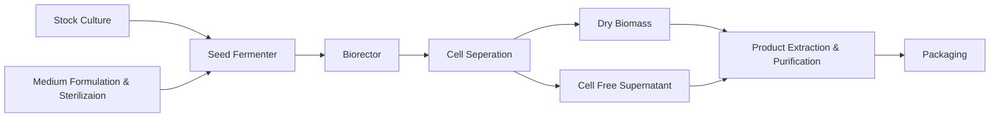

---
{"dg-publish":true,"dg-permalink":"Micro-Biotech","permalink":"/Micro-Biotech/","title":"Microbial Biotechnology","tags":["Tagless"],"dgShowToc":true,"noteIcon":"Biohazard_symbol.svg","dg-note-properties":{"Type":null,"up":["[[Branches/Real UnI Stuff]]"],"down":null,"Yesterday":null,"Tomorrow":null,"Embedded":null,"Next":null,"Previous":null,"aliases":["Microbial Biotechnology"],"title":"Microbial Biotechnology","comments":true,"tags":["Tagless"]}}
---

<style id="Force_Custom_Fonts" type="text/css">@font-face{font-style:normal;font-family:"Merriweather";src:local("Merriweather")}@font-face{font-style:bolder;font-family:"Merriweather";src:local("Merriweather")}@font-face{font-style:normal;font-family:"Merriweather";src:local("Merriweather");unicode-range:U+0-FF,U+2E80-9FFF,U+F900-FAFF,U+FE30-FE4F,U+20000-2FA1F}@font-face{font-style:bolder;font-family:"Merriweather";src:local("Merriweather");unicode-range:U+0-FF,U+2E80-9FFF,U+F900-FAFF,U+FE30-FE4F,U+20000-2FA1F}@font-face{font-style:normal;font-family:"Merriweather";src:local("Merriweather");unicode-range:U+0-FF}@font-face{font-style:bolder;font-family:"Merriweather";src:local("Merriweather");unicode-range:U+0-FF}:not(pre):not(code):not(textarea):not(tt):not(kbd):not(samp):not(var){font-family:"Merriweather"!important}pre,code,textarea,tt,kbd,samp,var{font-family:monospace!important}pre *,code *,textarea *,tt *,kbd *,samp *,var *{font-family:monospace!important}
 img{
 float: right;
}
</style>
# <center><span style="color:#FEDCBA">Microbial Biotechnology</span></center>


## Week 1 Biotechnology?
The creation of products from raw materials with the aid of living organisms

Biotechnology = bios (life) + logos (study of essence)
Literally: ‘the study of tools from living things’

### Timelines

```chronos
- [1919] biotechnology | Hungarian engineer Karl Ereky coins the term 'biotechnology'
- [1981] Integration |The integrated use of biochemistry, microbiology and chemical engineering in order to achieve the technological application of the capacities of microbes and cultures.
- [1981] European Federation of Biotechnology
- [2000] Industrialisation | Microbial biotechnology is the use of microorganisms to obtain an economically valuable product or activity at a commercial or large industrial scale. The microorganisms used in are either natural, laboratory-selected mutants or ‘novel’ genetically engineered strains
```
(What This Looks Like My End)

#### Putting Microbes To Work
- Traditional biotechnology includes: making bread, cheese, wine, beer and other fermented food products
- 20th century saw the birth of the modern biotechnology industry
	- products include antibiotics and other medicines, enzymes, vaccines, food ingredients

#### The Development Of Biotechnology

```chronos
- [1850~1900] Traditional processes | brewing, wine, dairy, fermented foods (e.g. pickles, soy sauce)
- [1900~1940] Industrial Era | Sewage Treatment, Solvent And Vaccine Production
- [1940~1980] Recent Progress | Antibiotics, Enzymes, Amino Acids, Steroid Hormone Transformations, Single Cell Protein (SCP)
- [1980~] Current Day | Recombinant DNA Productions (E.G Human Insulin, Interferon)
```
(What This Looks Like My End)
.png)


### Types Of Processes

#### Production Of Biochemicals
- small molecules - metabolites
- large molecules - enzymes
#### Production Of Biomass (Cells)
- bakers yeast,
- SCP
- vaccines
#### Production Of Foods
- dairy products
- brewing
- pickled foods
#### Degradative Processes
- sewage treatment
- composting
#### Bioenergy
- "biogas"/methane
- ethanol,
- hydrogen

### Reasons Microorganisms Are Used In Biotechnology
- Readily grown under controlled conditions
- Very rapid growth and metabolic rates
- Products of high purity and high yield
- Higher yielding strains readily developed by e.g. mutation + possibilities of genetic engineering
- As a group, microorganisms will carry out a vast range of processes, many of which are unique
	- ( ie. no feasible alternative method exists )

### Nutritional and cultural requirements for the growth of microorganisms


"Product" - commercially valuable product (e.g. amino acids to improve food taste, quality or preservation, enzymes, vitamins or pigments, hydrogen, ect.)
The microbe is the key factor to the process - an essential reactant

### Basic principles of industrial processes
- Growth of microbial cells
	- CHONPS (Carbon, Hydrogen, Oxygen, Nitrogen, Phosphorus, Sulphur) and trace elements
		- SUBSTRATE → PRODUCT
- Environmental conditions
	- temperature, oxygen, pH, light
- Equipment
	- growth vessel = fermenter
		- fermentation

### Fermenter & associated process
- made of materials able to withstand high pressure and temperature
- material used is selected according to the nature of the process
- resistant to corrosion

### Sterilisation and fermentation
During fermentation the following points must be observed to ensure sterility:
- sterility of the culture media
- sterility of incoming and out coming air
- appropriate construction of the bioreactor for sterilisation and for prevention of contamination

### Stirred tank reactor (STR) or Stirred tank fermenter (STF)
STR has mechanically moving impellers within baffled cylindrical vessel Whereas The STF Has No Moving Internals


STR/STF

![[Agitated_vessel.svg\|Agitated_vessel.svg]]
Schematics of an agitated vessel with a Rushton turbine and baffles


### Common measurements and control systems in fermenters

#### Temperature control
- Critical for optimum growth

#### Gas supply/Aeration
- Related to flow rate and stirrer speed
- Dependent on temperature

#### Mixing
- Depends on fermenter dimensions, paddle design and flanging
- Control aeration rate
- May cause cell damage (shear)


#### pH control
- Important for culture stability/survival

#### Foaming control
- Prevents culture losses and contamination


### Agitation in STR
Agitation is performed in order to mix all three phases within fermenter:
- liquid (dissolved nutrients and metabolites)
- solid (cells and any solid substrates)
- gas (oxygen and carbon dioxide)

This Is Done in order to produce homogeneous condition and promote nutrient, gas and heat transfer.

#### Agitation/mixing
Mixing (agitation) is important for oxygen transfer into liquid from the gas phase, because It:
- reduces bubble size to increase oxygen transfer
- prolongs retention of air bubbles in suspension
- decrease film thickness at the gas-liquid interface

Structural components involved :
- the agitator
- stirrer glands and bearings
- baffles & the aeration system

The efficiency of mixing (stirring) is determined by: 
- the fluid properties
- shape & dimensions of the vessel 
- impellers.

### Basic functions of a fermenter
- provides a controlled environment for the growth of an organism to obtain a desired product
- capable of aseptic operation for a number of days
- adequate aeration and agitation
- low power consumption
- temperature and pH control
- sampling facilities
- minimal evaporation losses
- suitable for a range of processes
	- STR not suitable for fragile cells
- design for minimum labour in operation, harvesting, maintenance and cleaning
- construction - smooth internal surfaces ( glass, stainless steel)
- adequate service provision
- geometry - similar for smaller / larger FV’s within plant, facilitates scale-up

### Chemical engineering process
- Upstream processing
- Fermentation
	- types of fermenters (bioreactors)
	- mode of operation : batch or continuous culture
	- instrumentation and control, environmental optimisation (sensors)
- Downstream processing
	- product extraction and purification
- Ancillary equipment

### A schematic representation of typical fermentation process





### Fermenter & associated process equipment
Bacterial cells: 
- generally robust and readily growth ; many possible systems

Plant/animal cells:
- fragile, less adaptable, slow growth; modify systems to suit

Photosynthetic cells:
- special requirement for light

### Batch Fermenter
Batch fermentation is what is described as a 'closed system

 - In batch fermentation, all nutrients necessary for cell growth and product production are present in the medium from start at zero time.
- The batch fermentation starts by inoculation with biomass from a culture starter (seed reactor)
- The batch process is finished when nutrients (mostly carbon source) have been used by biomass.
- A disadvantage - only a limited amount of the carbon source can be used.
- This will limit production of the useful product in the process.


### Characteristics of Fed Batch Fermenters


DOT: dissolved oxygen tension

- Initial medium concentration is relatively low (no inhibition of culture growth)
- Medium constituents (concentrated C and/or N feeds) are added continuously or in increments
- Controlled feed results in higher biomass and product yields
- Fermentation is still limited by accumulation of toxic end products

### Characteristics of Continuous Fermenters
- Input rate = output rate (volume = const.)
- Flow rate is selected to give steady state growth
	- Dilution rate > Growth rate → culture washes out
	- Dilution rate < Growth rate → culture overgrows
	- Dilution rate = Growth rate → steady state culture

- Product is harvested from the outflow stream
- Stable chemostat cultures can operate continuously for weeks or months.
![[Pasted image 20260930093810.png\|200]]
### Fermenter design
“the design of a fermenter to carry out a fermentation in an efficient and predetermined manner is the most important objective function of fermentation engineering”

### Stirred tank reactor (STR)
- Have mechanically moving impellers within baffled cylindrical vessel
- Must create high turbulence to maintain transfer rate
- Unsuitable for many animal and plant (fragile) cells or filamentous microbes

### Production of mycophenolic acid by Penicillium brevicompactum immobilized in a rotating fibrous-bed bioreactor (RFB)
Fungal morphology observed in free-cell stirred-tank (STF) and immobilized-cell rotating fibrous-bed (RFB) fermentations:

STF:
- fungal mycelia grew everywhere
- large clumps of biomass was attached to the agitation shaft, pH and DO probes, reactor wall

RFB:
- all fungal mycelia were attached to the rotating fibrous matrix, forming a homogeneous biofilm,
- fermentation broth was clear.


### Z®RP bioreactor
- Rotating bed system in which the cell are cultured in a continuous process.
- Optimal culture conditions are generated by regulation of cell culture parameters and cells grow under near physiological conditions.
- Sponceram® carrier materials are suited for culturing anchorage-dependent cell
- Used for:
	- stem cells,
		- tissue engineering
- http://www.zellwerk.biz/prod_impl_en.html

Small Fermenters Produce Less Waste

#### Z®RP Implant Blanks

A - SEM capture of chondrocytes in ECM, long-term culture on
Sponceram® HA surface (5000-times magnification)- skin-like tissue
B- Cartilage layer, grown in vitro on Sponceram® HA cell carrier
(courtesy of TU Hamburg-Harburg) - bone-like
Blanks Support Growth In The Shape You Need

### [[Uni/3/6AB023 Microbial Biotechnology/Microbial Biotechnology (# Edit conflict 2026-10-02 2zompcC #)#Stirred tank reactor (STR)\|STR Again]]
### Airlift fermenters
- Tall, thin vessel, sometimes conical at the top
	- the widest area used for gas exchange
- The system has no moving parts.
	- Shaft And Propellor Gone
	- gas bubbles initiate the upward movement (mixing and aeration)
	- low risk of contamination
- Lower energy requirements
- Do not required internal cooling system
- Used in large scale manufacture of biopharmaceutical products e.g. monoclonal antibodies obtained from fragile, shear-sensitive cells.
- Hollow pipe or riser in the tube for the air to move upwards to the top of the vessel
- At the top the draft tube the aerated fluid/culture ‘spills over’ and starts to fall towards the bottom
- The space above the draft tube allows for easy gas transfer from the liquid to the gas phase
	- the specific gravity of the liquid increases
	- liquid returns to the bottom of the vessel to be re-gassed
	- liquid begins to rise again

a) draft-tube configuration, b) a split cylinder device, c) an external loop system

### Scale-up of Oldenlandia affinis cultures in air-lift photobioreactors
- Plants are source of a large number of useful pharmaceuticals.
- Cyclotides are di-sulfide rich mini-proteins with broad range of biological activity such as anti-HIV, cytotoxic and antimicrobial.
- The major problems hindering the development of large-scale cultivation of plant cells include:
	- low productivity, cell line instability
- Shake flask cultures are used, but industrial fermentation of natural products requires highly reproducible conditions.
- Need for scale-up and fermenter.

### Photobioreactors for cyclotide production
- The bubble column was operated at 800 ml working volume.
	- O. affinis suspension culture started to foam after three days and plant cells adhered to the glass tube of the reactor.
- Adhesion is correlated with excretion of polysaccharides That Are Poduced
- Cell adhesion was also observed in the loop system
- The cultures in the air-lift loop bioreactor showed:
	- a considerably higher growth due to controlled and improved light supply
	- increased synthesis of chlorophyll, the supposed prerequisite for peptide synthesis.

The design of bioreactor is a very important factor!

### Environmental monitoring and control
- The success of fermentation depends upon the existence of defined environmental conditions for biomass production and product formation.
- We need to know how to obtain optimal operating conditions.
- It is necessary to keep: temperature, pH, agitation, oxygen concentration in the medium and other factors constant during the process using a suitable control system e.g. sensors/ biosensors.

### BIOSENSORS in fermentation processes

#### Physical sensors
- thermistor
- gas flow meter
- tachometer
- foam sensor
#### Chemical sensors
- pH meter
- DO electrode (dissolved oxygen)
- CO2 analyser
- oxygen analyser
- NAD analyser
#### Biosensor - a sub group of chemical sensors.

### SENSORS
In-line
- an integrated part of the fermentation equipment, obtained data are used directly for process control
On-line
- an integrated part of the fermentation equipment, direct measurement of fermentation parameters, the measured value cannot be used directly for control, an operator required for entering the data into the control system e.g. gas analyser
Off-line
- not part of the fermenter, requires sampling, the measured value cannot be used directly for control, operator needed for measurement and entering the data into the control panel
	- e.g. sample for spectrophotometric analysis

Real-time → instant, as it happens
### Computers applications in fermentation biotechnology
- Process control
	- timed series of operations e.g. sterilisation, medium addition, inoculation
- Data logging (e.g. printer, data store, graphics)
- Alarms
- Environmental control (e.g. pH, temperature)
- Dynamic optimisation
	- Active, instant response to the sensed environment to maintain environmental and physiological conditions at optimal levels to maximise culture productivity.
- Modelling of fermentations

### Foaming
 Foaming is caused when:
- microbial cultures excrete high levels of proteins and/or emulsifiers
- high aeration rates are used

Excess foaming causes loss of culture volume and may result in culture contamination

Foaming is controlled by use of a foam-breaker and/or the addition of anti-foaming agents (silicon-based reagents)

### SPINNING CONES AS FOAM CONTROLLERS

### Temperature control
- Heat supplied by direct heating probes or by heat exchange
- Microbial growth is very sensitive to temperature changes - accurate temperature feed-back control is required
- Fermentations are exothermic - cooling may be required

### pH control
- Most cultures have narrow pH growth ranges
- The buffering in culture media is generally low
- Most cultures cause the pH of the medium to rise during fermentation
- pH is controlled by using a pH probe, linked via computer to NaOH and HCl input pumps.

### Biosensor
Constructed device which employs biologically active material which provides specific recognition of the target analyte, to a transducer, whichvgenerates electrical signal directed to a digital reader/control system.

### Transducer
A physical element which converts the stimulus generated by the bioactive layer to an electrical
signal.

It may detect:
- a redox reaction
- light emission
- changed levels of ions
- luminescent/fluorescent signal
- a change in mass associated with surface

### Biosensor in monitoring and control

### Biosensors
Transducer
- Electrochemical
- amperometric
- potentiometric
- Optical
- Mechanical
- Thermal

Bioactive components
- Enzymes
- Monoclonal antibodies
- Cells
- microorganisms
- tissues
- Nucleic acids

![[Pasted image 20260925104627.png\|Pasted image 20260925104627.png]]

### Immobilised enzyme biosensor
- Porous polycarbonate layer, limits the diffusion of the substrate into the second Immobilised Enzyme Layer, preventing the reaction becoming enzyme-limited
- The third layer, cellulose acetate, permits only small molecules, such as hydrogen peroxide, to reach the electrode
- The substrate is oxidised, in the enzyme layer, producing hydrogen peroxide, oxidised on platinum electrode
- The resulting current is proportional to the concentration of the substrate

### Penicillin biosensor


### Biosensors
Measuring devices comprising a biological element (e.g.
enzyme, antibody, microorganism) connected or integrated
to a physical or chemical transducer

Advantages:
- high selectivity
- high specificity
- relative low cost
	- reduce assay time
	- can increase product safety
- small size
- on-line control of the fermentation process

Restrictions:
- optimal pH
- optimal temperature

## Week 2 Biodegradable Polymers.  

### Terminology

##### Polymer
are large molecules (macromolecules)  composed of many repeated sub-units (monomers)  

##### homopolymer
Only one subunit 
E.G -A-A-A-A-A-  

##### heteropolymer (co-polymer) 
Multiple subuinits 
E.G -A-B-B-A-C-  

##### Biopolymer 
polymer made from natural resources E.G Starch

##### Bioplastic
large family of different materials (either biobased, biodegradable or both)  
if biodegradable, it must be degraded completely, to only  natural biogenic compounds such as water, CO2, biomass  

##### Biobased
material derived from biomass - renewable resources, not from fossil oil  

##### Biodegradable
able to decay naturally and in a way that is not harmful
Biodegradability depends on the chemical structure of the material 

### Polymeric Materials
Classification by susceptibility to microorganism/enzymatic attack:  

#### Non-biodegradable  
(polyethylene – PE, polypropylene – PP,  polystyrene – PS)  

#### Biodegradable  
(polylactide – PLA, regenerated cellulose, starch, bacterial polymers)

### Polymers and plastics  
Plastics are materials formulated and prepared for use  
The main components of plastics are the polymers with additives  


### Biopolymers & Microbes

#### Which biopolymers should be produced ?
- Currently only a few biopolymers can compete with their petrochemical equivalents  
	- based on price & performance  
- Bacterial cellulose (BC), Poly-glutamic acid (PgGA) Poly-hydroxyalkanoates (PHA) and Poly-lactic acid (PLA) are good examples of biopolymers that could capture a substantial part of the bioplastic market  
#### What is poly-γ-glutamic  
- Polymer of glutamic acid residues.  
	- unusual anionic polypeptide in which D and/or L-glutamate is polymerized via γ-amide linkages  
- Non-toxic, non-immunogenic and edible  

##### Applications of γ-PGA

###### FOOD  
- Cryoprotectant  
- Bitterness relieving agent  
- Thickener  
- Humectant  
- Properties of wheat dough  

###### MEDICAL  
- Drug delivery  
- Nanoparticles  
- Biological adhesive  
- Biodegradable scaffold  
- Anti-mutagenic agent  

###### OTHER  
- Waste water treatment  
- Cosmetics  
- Diapers  
 


### Analysis  

Salt/Acid form of γ-PGA (ICP)  
Yield (g/l)  
Crystallinity (XRD)  
Identification (FTIR, NMR)  
Molecular weight (GPC)

#### Yield


#### XRD


#### Molecular weight  

#### Medium E
Strain name Molecular weight  
(Da) (Mw)  
Molecular  
number(Mn)  
Dispersity  
(Mw/Mn)  
B. licheniformis  
NCIMB 1525  
871000 647000 1.35  
B. licheniformis  
NCIMB 6816  
850000 596500 1.45  
Strain name Molecular weight  
(Da) (Mw)  
Molecular  
number(Mn)  
Dispersity  
(Mw/Mn)  
B. subtilis natto 257000 605000 1.2  
B. licheniformis  
NCIMB 6816  
856500 715500 1.2  
Medium E  
Medium GS  
•6 remaining strains produced LMW γ-PGA ~ 3000 Da

Determining hemolytic activity for B. cereus and B. subtilis on blood agar  
B. cereus – Presence of hemolytic activity confirmed  
with the presence of halo around colonies  
B. subtilis natto – Absence of hemolytic activity  
confirmed with the absence of halo around colonies  
Hemolytic activity

Determining lecithinase activity for B. cereus and B. subtilis on nutrient agar  
supplemented with 8% egg yolk emulsion  
B. cereus – Presence of lecithinase activity confirmed  
with the presence of growth & halo on plates  
B. subtilis natto – Absence of lecithinase activity  
confirmed with absence of halo on plates  
Lecithinase activity

2000  
1000  
800  
700  
600  
500  
400  
DW DS DC EW ES EC FW FS FC  
2000  
1000  
800  
700  
600  
500  
400  
AW AS AC BW BS BC CW CS CC  
A - hbl- D/A  
B - nheB  
C - bceT  
D - entFM  
E - sph  
F - piplc  
W = Water  
S = B. subtilis  
C = B. cereus  
PCR of genes encoding toxins

Probiotics  
‘Live microorganisms  
that when administered  
in adequate amounts  
confer a health benefit  
on the host’  
World Health Organization  
(2002)

Freeze drying Storage Ingestion  
Challenge - Maintaining viability of ‘friendly’  
bacteria

Viability of B. breve in simulated gastric juice  
(Free cells and polymer protected cells)  
0  
1  
2  
3  
4  
5  
6  
7  
8  
9  
10  
0 1 2 3 4  
Log (CFU/ml)  
Time (h)  
Free cells  
Polymer protected  
cells  
Bhat, A., Irorere, V., Bartlett, T., D. Hill, D., Kedia, G., Charalampopoulos, D., Nualkaekul, S. and Radecka, I. (2014) Improving survival of probiotic bacteria using bacterial  
Poly-γ-glutamic acid, International Journal of Food Microbiology, DOI: 10.1016/j.ijfoodmicro.2014.11.031  
Bhat A., Irorere VU., Bartlett T., Hill D., Kedia G., Morris M.R., Charalampopoulos D. Radecka I. (2013) Bacillus subtilis natto: a non-toxic source of poly-γ-glutamic acid that  
could be used as a cryoprotectant for probiotic bacteria. AMB Express 3:36, doi:10.1186/2191-0855-3-36.

PCT/GB2012/052149, Improved viability of probiotic microorganisms,  
Publication date 7 March 2017  
A. Bhat, V. Irorere, T. Bartlett, D. Hill, G. Kedia, D. Charalampopoulos, S. Nualkaekul, I. Radecka,  
International Journal of Food Microbiology 196 (2014) 24-31, doi:10.1016/j.ijfoodmicro.2014.11.031  
A. Bhat, V.U. Irorere, T. Bartlett, D. Hill, G. Kedia, M.R. Morris, D. Charalampopoulos, I. Radecka, AMB  
Express 3:36 (2013), doi:10.1186/2191-0855-3-36  
Patent  
CULTURE SHOCK!!!  
PG  
A  
PG  
A  
I would like  
to thank my parents  
and γ-PGA…  
How does he stay viable  
after all we go through  
during storage and  
ingestion?!

Use of oncolytic adenovirus coated  
with γ- PGA for effective and safe  
cancer therapy.

Cancer therapies  
Side effects  
Van Dorp et al ., (2012) Long-term endocrine  
side effects of childhood Hodgkin's  
lymphoma treatment: a review. Human  
reproduction update, 18(1), pp.12-28  
Smart Adenovirus Nano complexes as  
a Therapeutic Vehicle?

Oncolytic Ad  
• preferentially infects and kills cancer cells  
Limitation:  
• Immune response  
• High liver tropism  
• Lack of tumour tropism upon systemic delivery  
Kwon, O.J., Kang, E., Choi, J.W., Kim, S.W., Yun, C.O. (2013) Therapeutic targeting of chitosan–PEG–folate-complexed Oncolytic adenovirus for active and systemic  
cancer gene therapy Journal of controlled release, 169(3), pp.257-265

Modification of Ad is needed to:  
- increase retention time in the blood  
- avoid accumulation in the liver

Polymeric coated Ad

Ionic-gelation Method  
Encapsulation efficiency 93%  
Khalil, IR., Irorere, VU., Radecka, I., Burns, ATH., Kowalczuk, M., Mason, JL., Khechara, M. (2017) Bacterial-Derived Polymer Poly-γ-Glutamic Acid (γ-PGA)-Based  
Micro/Nanoparticles as a Delivery System for Antimicrobials and Other Biomedical Applications. International Journal of Molecular Sciences ; 18(2) ; DOI:  
10.3390/ijms18020313 ·

- Visible clear  
attachment and/or  
internalisation of NPs  
- PGA can boost cellular  
uptake possibly  
through a specific  
receptor-mediated  
pathwayFITC-labelled γ-PGA-chitosan NPs  
a) Labelled NPs suspended in de-ionised water  
b) HEK293 cells not exposed to labelled NPs (control)  
c) HEK293 cells exposed to FITC-labelled NPs;  
d) Overlaying image of HEK293 cells exposed to FITC-labelled NPs.  
a) b)  
c) d)  
100 um  
10 um  
HEK 293 cells  
Khalil et al., 2018. Poly-Gamma-Glutamic Acid (γ-  
PGA)-Based Encapsulation of Adenovirus to Evade  
Neutralizing Antibodies. Molecules 2018, 23(10),  
2565; https://doi.org/10.3390/molecules23102565

(A) Alaria esculenta, (B) Laminaria digitata, and (C)  
Saccharina latissimi, Oban, United Kingdom. Pictures provided by the  
Scottish Association of Marine Science SAMS  
Parati et al., 2023 Front. Chem.,Sec. Green and Sustainable Chemistry  
Volume 11 - 2023 | https://doi.org/10.3389/fchem.2023.1158147  
Sustainable production

Xerostomia, acidic drinks and bacterial  
PGA  
- Salivary phosphoproteins protect the enamel from acid  
dissolution and acting as a reservoir for free calcium ions  
- A reduction in salivary flow leads to a prolonged dry mouth,  
known as xerostomia  
- Xerostomia include severe dental hard tissue destruction,  
leading to a clinical condition termed “rampant dental  
caries”  
The biochemical and physical properties of ɣ-PGA suggest its suitability  
as an anti-cariogenic agent, and a therapeutic treatment for rampant  
caries associated with xerostomia

Protection of tooth enamel project  
Microbial polymer of γ-PGA tested showed an  
excellent inhibitory effect on the dissolution rate of  
calcium ions form teeth enamel  
Parati et al. (2022) 14(14), Polymers, 14(14), p.2937. doi:10.3390/polym14142937

Brown Algae as a Valuable Substrate for the Cost-  
Effective γPGA for Applications in Cream Formulations  
- Successful incorporation of seaweed-  
derived γ-PGA (0.2–2 w/v%) was achieved  
for several model cream systems with  
absorbances reported at 300 and 400 nm.  
-  
Seaweed-derived γ-PGA cream systems  
did not display any negative effect on  
model HaCaT keratinocytes by means of  
in vitro MTT  
Parati et al., 2024 Polymers 2024, 16(14), 2091;

Can γ-PGA help fight Parkinson’s ?  
- γ-PGA has previously demonstrated anti  
inflammatory/antioxidative properties and has shown  
to alleviate neuronal cell death  
- Can γ-PGA reverse cytotoxic effect and cellular  
inflammation?  
- Can γ-PGA be explored as a potential therapeutic  
molecule in the context of α-synuclein pathology?

RIF 4  
Silva, S., Almeida, A.J. and Vale, N. (2021) Pharmaceutics, 13(4), p.508.  
doi:10.3390/pharmaceutics13040508.  
PFF  
Can microbes help fight Parkinson’s ?  
- Parkinson’s disease (PD) affects around ten  
million people worldwide  
- PD is the second most widespread  
neurodegenerative disease after  
Alzheimer’s disease  
- PD pathology is characterized by a loss of  
dopaminergic neurons and the  
development of lewy bodies - proteins,  
mainly α-synuclein.

RIF 4  
Silva, S., Almeida, A.J. and Vale, N. (2021) Pharmaceutics, 13(4), p.508.  
doi:10.3390/pharmaceutics13040508.  
PFF  
Can microbes help fight Parkinson’s ?  
- α-synuclein during stress or degeneration can  
be released into extracellular environment and  
can be taken up by neurons and astrocytes  
- astrocytes normally are involved in clearance of  
α-synuclein, therefore protect neurones, however  
their capacity is limited  
- extensive uptake leads to cellular toxicity and  
inflammation and astrocytes loose protective  
role

γ-PGA as a chelator of protein accumulation  
Alzheimer's disease, Parkinson's diseases, amyotrophic lateral sclerosis, dementia with Lewy bodies,  
frontotemporal dementia, Huntington's disease, amyloid transthyretin cardiomyopathy are all Protein  
aggregation diseases  
Increasing concentration of high molecular weight γ-PGA

Inflammatory analysis - analysis undergoing  
Legend:  
Astrocytes;  
nuclear  
DNA/RNA;  
C3 inflammation

γ-PGA limits the extent of α-synuclein PFFs in primary astrocytes  
γ-PGA has a marked inhibitory effect on astrocyte ability to internalize α-  
synuclein PFFs, leading to reduced cellular toxicity  
Novelo et al., 2025 International Journal of Biological Macromolecules 318 (2025) 145303

The Guardian September 2017  
Plastic fibres found in tap water around the world, study reveals….  
‘Microplastic contamination has been found in tap water in countries around the world, leading to  
calls from scientists for urgent research on the implications for health…’  
www.theguardian.com/environment/2017/sep/06/plastic-fibres-found-tap-water  
Sea salt around the world is contaminated by plastic, studies show…  
‘New studies find microplastics in salt from the US, Europe and China, adding to evidence that  
plastic pollution is pervasive in the environment…’  
www.theguardian.com/environment/2017/sep/08/sea-salt-around-world-contaminated-by-plastic

Problems with synthetic plastics  
- Plastics litter oceans and the coastlines  
- Plastics use valuable/limited oil resources  
- Some plastics leach small amounts of  
pollutants, that are toxic to life  
- PE the most manufactured pertochemical  
polymer (29% of global production)  
- Only 10% recycled !  
National Environmental Center (2014)  
Storify.com (2016)  
Verlinden R. A. J., Hill D. J., Kenward M. A., Williams C. D. and Radecka I. (2007) Bacterial synthesis of biodegradable polyhydroxyalkanoates. Journal of Applied Microbiology 102(6), pp1437-  
1449.  
Jiang, G., Hill, D., Kowalczku, M., Johnston, B., Adamus, G., Irorere, V. and Radecka, I. (2016) Carbon sources for polyhydroxyalkanoates and an integrated biorafinery (2016) International  
Journal of Molecular Sciences 17(7), 1157

Microbial bioplastic  
- Are produced bacteria as  
a carbon and energy  
storage material  
- Synthesized as  
intracellular granules  
- Accumulated as a result of  
nutrient limitation in the  
presence of excess  
supply of carbon source  
Verlinden R. A. J., Hill D. J., Kenward M. A., Williams C. D. and Radecka I. (2007) Bacterial synthesis of  
biodegradable polyhydroxyalkanoates. Journal of Applied Microbiology 102(6), pp1437-1449.

- Are produced by bacteria  
as a carbon and energy  
storage material  
- Synthesized as  
intracellular granules  
- Accumulated as a result of  
nutrient limitation in the  
presence of excess  
supply of carbon source  
Microbial  
polyhydroxyalkanoates (PHA)  
Images adopted from:  
Bresan et al. 2016; Scientific reports, www.nature.com/articles  
https://polymerinnovationblog.com/polyhydroxyalkanoates-natures-polyester/

Polyhydroxyalkanoates  
(PHAs)  
- Are produced bacteria as a carbon and  
energy storage material  
- Synthesized as intracellular granules  
- Accumulated as a result of nutrient  
limitation in the presence of excess  
supply of carbon source  
Verlinden R. A. J., Hill D. J., Kenward M. A., Williams C. D. and Radecka I. (2007) Bacterial synthesis of biodegradable  
polyhydroxyalkanoates. Journal of Applied Microbiology 102(6), pp1437-1449.  
Images adopted from: www.nature.com/articles & BBC web

Bacterial PHB  
- Homopolimer -A-A-A-A-A-  
- White crystalline powder with isotactic structure  
- High molecular weight and melting point (~180 oC)  
- Biodegradable and non-toxic  
- BUT rather brittle  
Solution: Copolymerization  
Adapted from:  
Madigan M.T; Martinko, J.P and Parker, J. Brock Biology of Microorganisms (2008)O  
CH3 H O  
n

Copolymers -A-A-A-B-B-A-C-  
- different monomers, almost always 3-hydroxy fatty  
acids  
- BUT may also contain 4-, 5- and 6- hydroxy fatty  
acids or monomers with aromatic rings  
- Mixed carbon sources neededy  
O  
R H O  
O  
CH3 H O  
x  
CH2CH3 3-hydroxyvalerate PHBV  
CH2CH2CH3 3-hydroxyhexanoate PHBHx

Properties of PHAs compared to polypropylene (PP)  
Parameter PHB PHBV PHBHx PP  
Melting temperature (°C) 177 145 127 176  
Glass transition temp (°C) 2 -1 -1 -10  
Crystallinity (%) 60 56 34 50-70  
Tensile strength (MPa) 43 20 21 38  
Extension to break (%) 5 50 400 400  
Biomaterial properties

Where has it been applied?  
AGRICULTURE  
- mulch films  
MEDICAL  
-biodegradable scaffolds  
-controlled antibiotic release  
systems,  
- implants, sutures  
-heart valves  
-bone graft substitutes  
OTHER  
- Packaging  
- Coatings  
- Car industry  
- Textiles

Bacterial bioplastics from waste cooking oil  
Waste cooking oil  
Bacteria with PHA  
granules Bioplastics!  
‘Work by a research team at the University of Wolverhampton suggests that using  
waste cooking oil as a starting material for the production of bioplastic can  
reduce production costs significantly…’  
Verlinden R. A. J., Hill D. J., Kenward M. A., Williams C. D. Piotrowska-Seget Z and Radecka, I (2011): Production of  
polyhydroxyalkanoates from waste frying oil by Cupriavidus necator. AMB Express. 1(1):11. doi: 10.1186/2191-0855-1-11

Electrospun Fibres of Polyhydroxybutyrate  
Synthesized by Ralstonia eutropha from Different  
Carbon Sources  
Victor U. Irorere, Soroosh Bagheriasl, Mark Blevins, Iwona Kwiecien,  
Artemis Stamboulis and Iza Radecka, International Journal of Polymer Science,  
2014, D 705359, doi.org/10.1155/2014/705359  
nanofibres

Rydz et al, 2015. Int. J. Mol. Sci. 2015, 16, 564-596;  
doi:10.3390/ijms16010564  
CO2 as  
substrate  
Using CO2 as substrate could  
reduce CO2 emission and  
contribute to the advances  
towards plastics removal

PHA as biomaterials  
- biomedical/pharmaceutical areas have been approved by  
FDA in 2007  
- PHAs are biodegradable, biocompatible, they are used to  
produce microspheres, microcapsules, and nanoparticles,  
films and porous matrices  
- their degradation products are non toxic  
- drug release from the polymeric material occurs through  
osmosis, diffusion or biodegradation mechanism  
- release depends on composition of the composition of PHA

3D printed PLA/PHA filaments  
Vertical specimens have  
improved mechanical properties  
compared to horizontal specimens,  
MTT assay with HEK293 shows the horizontally  
printed specimen tended to produce more growth  
from day 4 onwards.  
Rydz et al, 2018, Polymer degradation and stability, 152191-207.,

- Regenerative  
medicine  
- Bio-implants  
- 3D printing material  
- Surgical stitching and  
coronary stents  
- Time release capsules  
PHA applications  
Growth Factors  
BioMaterials  
Matrices Cells  
Park et al., 2017 Progress in Polymer Science 68 (2017) 77–105

Journal of Applied Microbiology  
Volume 102, Issue 6, pages 1437-1449, 10 APR 2007 DOI: 10.1111/j.1365-2672.2007.03335.x  
http://onlinelibrary.wiley.com/doi/10.1111/j.1365-2672.2007.03335.x/full#f5

What is bacterial cellulose ?  
- Bacterial cellulose (BC) is a natural  
biopolymer synthesized in abundance  
by different strains of bacteria  
- Consist only glucose monomer  
- BC unique properties:  
- Biocompatibility  
- Can be mouldable into 3D structures  
- Chemically pure  
- Ultra fine network

What is bacterial celluose ?  
- Bacterial cellulose (BC) is a natural biopolymer  
synthesized in abundance by different strains of  
bacteria  
- Acetobacter sp, Rhizobium sp.  
- Consist only glucose monomer  
- BC unique properties:  
- Biocompatibility  
- Mouldable into 3D structures  
- Chemically pure  
- Ultra fine network

Why is it produced?  
Bacterial cellulose  
Resistance to adverse environments  
DesiccationUV radiation  
Virulence  
Biofilm  
formation  
Other  
Plant  
symbiosis  
Cell-cell  
interaction  
Trends Microbiol. 2015 Sep; 23(9): 545–557

Where has it been applied?  
FOOD  
- Cryoprotectant  
- Nata-de-coco dietary  
fibre  
- Emulsifier  
MEDICAL  
- Wound dressings for wounds  
- Wound dressings for burns  
- Artificial blood vessels  
- Bone scaffold  
OTHER  
- Packaging  
- Cosmetics  
- Paper  
- Textiles  
Image result for bacterial cellulose images

…Microbes can and will  
do anything, microbes are  
smarter, wiser and more  
energetic than  
microbiologists,  
chemists, engineers, and  
others…  
(Perlmon,1980)  
Small bugs - big opportunities

## Annotations