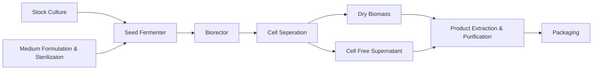

---
{"dg-publish":true,"dg-permalink":"Micro-Biotech","permalink":"/Micro-Biotech/","title":"Microbial Biotechnology","tags":["Tagless"],"dgShowToc":true,"noteIcon":"","dg-note-properties":{"Type":null,"up":["[[Branches/Real UnI Stuff]]"],"down":null,"Yesterday":null,"Tomorrow":null,"Embedded":null,"Next":null,"Previous":null,"aliases":["Microbial Biotechnology"],"title":"Microbial Biotechnology","comments":true,"tags":["Tagless"]}}
---

<style id="Force_Custom_Fonts" type="text/css">@font-face{font-style:normal;font-family:"Merriweather";src:local("Merriweather")}@font-face{font-style:bolder;font-family:"Merriweather";src:local("Merriweather")}@font-face{font-style:normal;font-family:"Merriweather";src:local("Merriweather");unicode-range:U+0-FF,U+2E80-9FFF,U+F900-FAFF,U+FE30-FE4F,U+20000-2FA1F}@font-face{font-style:bolder;font-family:"Merriweather";src:local("Merriweather");unicode-range:U+0-FF,U+2E80-9FFF,U+F900-FAFF,U+FE30-FE4F,U+20000-2FA1F}@font-face{font-style:normal;font-family:"Merriweather";src:local("Merriweather");unicode-range:U+0-FF}@font-face{font-style:bolder;font-family:"Merriweather";src:local("Merriweather");unicode-range:U+0-FF}:not(pre):not(code):not(textarea):not(tt):not(kbd):not(samp):not(var){font-family:"Merriweather"!important}pre,code,textarea,tt,kbd,samp,var{font-family:monospace!important}pre *,code *,textarea *,tt *,kbd *,samp *,var *{font-family:monospace!important}
 img{
 float: right;
}
</style>
# <center><span style="color:#FEDCBA">Microbial Biotechnology</span></center>

## Week 1 
### What is biotechnology?
meaning the production of products from raw materials with the aid of living organisms
Biotechnology = bios (life) + logos (study of essence)
Literally ‘the study of tools from living things’

### Timelines

```chronos
- [1919] biotechnology | Hungarian engineer Karl Ereky coins the term 'biotechnology'
- [1981] Integration |The integrated use of biochemistry, microbiology and chemical engineering in order to achieve the technological application of the capacities of microbes and cultures.
- [1981] European Federation of Biotechnology
- [2000] Industrialisation | Microbial biotechnology is the use of microorganisms to obtain an economically valuable product or activity at a commercial or large industrial scale. The microorganisms used in are either natural, laboratory-selected mutants or ‘novel’ genetically engineered strains
```

#### Putting microbes to work
- Traditional biotechnology includes: making bread, cheese, wine, beer and other fermented food products
- 20th century saw the birth of the modern biotechnology industry
	- products include antibiotics and other medicines, enzymes, vaccines, food ingredients

#### Stages in the development of biotechnology

```chronos
- [1850~1900] Traditional processes | brewing, wine, dairy, fermented foods (e.g. pickles, soy sauce)
- [1900~1940] Industrial Era | Sewage Treatment, Solvent And Vaccine Production
- [1940~1980] Recent Progress | Antibiotics, Enzymes, Amino Acids, Steroid Hormone Transformations, Single Cell Protein (SCP)
- [1980~] Current Day | Recombinant DNA Productions (E.G Human Insulin, Interferon)
```


### Types of processes

#### Production of biochemicals

- small molecules - metabolites
- large molecules - enzymes
#### Production of biomass (cells)

- bakers yeast,
- SCP
- vaccines
#### Production of foods

- dairy products
- brewing
- pickled foods
#### Degradative processes

- sewage treatment
- composting
#### Bioenergy

- "biogas"/methane
- ethanol,
- hydrogen

### Reasons for the use of microorganisms in biotechnology

- Readily grown under controlled conditions
- Very rapid growth and metabolic rates
- Products of high purity and high yield
- Higher yielding strains readily developed by e.g. mutation + possibilities of genetic engineering
- As a group, microorganisms will carry out a vast range of processes, many of which are unique
	- ( ie. no feasible alternative method exists )

### Nutritional and cultural requirements for the growth of microorganisms


"Product" - commercially valuable product (e.g. amino acids to improve food taste, quality or preservation, enzymes, vitamins or pigments, hydrogen, ect.)
The microbe is the key factor to the process - an essential reactant

### Basic principles of industrial processes

- Growth of microbial cells
	- CHONPS and trace elements
		- SUBSTRATE → PRODUCT
- Environmental conditions
	- temperature, oxygen, pH, light
- Equipment
	- growth vessel = fermenter
		- fermentation

### Fermenter & associated process

- made of materials able to withstand high pressure and temperature
- material used is selected according to the nature of the process
- resistant to corrosion

### Sterilisation and fermentation

During fermentation the following points must be observed to ensure sterility:
- sterility of the culture media
- sterility of incoming and out coming air
- appropriate construction of the bioreactor for sterilisation and for prevention of contamination

### Stirred tank reactor (STR) or Stirred tank fermenter (STF)
STR has mechanically moving impellers within baffled cylindrical vessel Whereas The STF Has No Moving Internals


### Common measurements and control systems in fermenters

#### Temperature control

Critical for optimum growth

#### Gas supply/Aeration

- Related to flow rate and stirrer speed
- Dependent on temperature

#### Mixing

- Depends on fermenter dimensions, paddle design and flanging
- Control aeration rate
- May cause cell damage (shear)


#### pH control
- Important for culture stability/survival

#### Foaming control
- Prevents culture losses and contamination


### Agitation in STR

Agitation is performed in order to mix all three phases within fermenter:
- liquid (dissolved nutrients and metabolites)
- solid (cells and any solid substrates)
- gas (oxygen and carbon dioxide)

This Is Done in order to produce homogeneous condition and promote nutrient, gas and heat transfer.

### Agitation/mixing

- Mixing (agitation) is important for oxygen transfer into liquid from the gas phase, because It:
	- reduces bubble size to increase oxygen transfer
	- prolongs retention of air bubbles in suspension
	- decrease film thickness at the gas-liquid interface
- Structural components involved :
	- the agitator
	- stirrer glands and bearings
	- baffles & the aeration system
- Efficiency of mixing (stirring) is determined by: the fluid properties, shape & dimensions of the vessel and impellers.

### Basic functions of a fermenter
- to provide a controlled environment for the growth of a organism to obtain a desired product
- capable of aseptic operation for a number of days, and should be reliable in operation
- adequate aeration and agitation
- low power consumption
- temperature and pH control
- sampling facilities
- minimal evaporation losses
- suitable for a range of processes (?) STR not suitable for fragile cells
- design for minimum labour in operation, harvesting, maintenance and cleaning
- construction - smooth internal surfaces ( glass, stainless steel)
- adequate service provision
- geometry - similar for smaller / larger FV’s within plant, facilitates scale-up

### Chemical engineering process
- Upstream processing
- Fermentation
	- types of fermenters (bioreactors)
	- mode of operation : batch or continuous culture
	- instrumentation and control, environmental optimisation (sensors)
- Downstream processing
	- product extraction and purification
- Ancillary equipment

### A schematic representation of typical fermentation process





### Fermenter & associated process equipment

Bacterial cells: 
- generally robust and readily growth ; many possible systems

Plant/animal cells:
- fragile, less adaptable, slow growth; modify systems to suit

Photosynthetic cells:
- special requirement for light

### Batch Fermenter

Batch fermentation is what is described as a 'closed system

 - In batch fermentation, all nutrients necessary for cell growth and product production are present in the medium from start at zero time.
- The batch fermentation starts by inoculation with biomass from a culture starter (seed reactor)
- The batch process is finished when nutrients (mostly carbon source) have been used by biomass.
- A disadvantage - only a limited amount of the carbon source can be used.
- This will limit production of the useful product in the process.


### Characteristics of Fed Batch Fermenters

- Initial medium concentration is relatively low (no inhibition of culture growth)
- Medium constituents (concentrated C and/or N feeds) are added continuously or in increments
- Controlled feed results in higher biomass and product yields
- Fermentation is still limited by accumulation of toxic end products


### Characteristics of Continuous Fermenters

- Input rate = output rate (volume = const.)
- Flow rate is selected to give steady state growth
	- Dilution rate > Growth rate  culture washes out
	- Dilution rate < Growth rate  culture overgrows
	- Dilution rate = Growth rate  steady state culture

- Product is harvested from the outflow stream
- Stable chemostat cultures can operate continuously for weeks or months.

### Fermenter design
“the design of a fermenter to carry out a fermentation in an efficient and predetermined manner is the most important objective function of fermentation engineering”

### Stirred tank reactor (STR)
- Have mechanically moving impellers within baffled cylindrical vessel
- Must create high turbulence to maintain transfer rate
- Unsuitable for many animal and plant cells or filamentous microbes

### Production of mycophenolic acid by Penicillium brevicompactum immobilized in a rotating fibrous-bed bioreactor (RFB)

Fungal morphology observed in free-cell stirred-tank (STF) and immobilized-cell rotating fibrous-bed (RFB) fermentations:

STF:
- fungal mycelia grew everywhere
- large clumps of biomass was attached to the agitation shaft, pH and DO probes, reactor wall

RFB:
- all fungal mycelia were attached to the rotating fibrous matrix, forming a homogeneous biofilm,
- fermentation broth was clear.


### Z®RP bioreactor
- Rotating bed system in which the cell are cultured in a continuous process.
- Optimal culture conditions are generated by regulation of cell culture parameters and cells grow under near physiological conditions.
- Sponceram® carrier materials are suited for culturing anchorage-dependent cell
- Used for:
	- stem cells,
		- tissue engineering
- http://www.zellwerk.biz/prod_impl_en.html

Small Fermenters Produce Less Waste

#### Z®RP Implant Blanks

A - SEM capture of chondrocytes in ECM, long-term culture on
Sponceram® HA surface (5000-times magnification)- skin-like tissue
B- Cartilage layer, grown in vitro on Sponceram® HA cell carrier
(courtesy of TU Hamburg-Harburg) - bone-like
Blanks Support Growth In The Shape You Need

### [[Uni/3/6AB023 Microbial Biotechnology/Microbial Biotechnology#Stirred tank reactor (STR)\|SRT Again]]
### Airlift fermenters
- Tall, thin vessel, sometimes conical at the top
	- the widest area used for gas exchange
- The system has no moving parts.
	- Shaft And Propellor Gone
	- gas bubbles initiate the upward movement (mixing and aeration)
	- low risk of contamination
- Lower energy requirements
- Do not required internal cooling system
- Used in large scale manufacture of biopharmaceutical products e.g. monoclonal antibodies obtained from fragile, shear-sensitive cells.
- Hollow pipe or riser in the tube for the air to move upwards to the top of the vessel
- At the top the draft tube the aerated fluid/culture ‘spills over’ and starts to fall towards the bottom
- The space above the draft tube allows for easy gas transfer from the liquid to the gas phase
	- the specific gravity of the liquid increases
	- liquid returns to the bottom of the vessel to be re-gassed
	- liquid begins to rise again

a) draft-tube configuration, b) a split cylinder device, c) an external loop system

### Scale-up of Oldenlandia affinis cultures in air-lift photobioreactors
- Plants are source of a large number of useful pharmaceuticals.
- Cyclotides are di-sulfide rich mini-proteins with broad range of biological activity such as anti-HIV, cytotoxic and antimicrobial.
- The major problems hindering the development of large-scale cultivation of plant cells include:
	- low productivity, cell line instability
- Shake flask cultures are used, but industrial fermentation of natural products requires highly reproducible conditions.
- Need for scale-up and fermenter.

### Photobioreactors for cyclotide production
- The bubble column was operated at 800 ml working volume.
	- O. affinis suspension culture started to foam after three days and plant cells adhered to the glass tube of the reactor.
- Adhesion is correlated with excretion of polysaccharides That Are Poduced
- Cell adhesion was also observed in the loop system
- The cultures in the air-lift loop bioreactor showed:
	- a considerably higher growth due to controlled and improved light supply
	- increased synthesis of chlorophyll, the supposed prerequisite for peptide synthesis.

The design of bioreactor is a very important factor!

### Environmental monitoring and control
- The success of fermentation depends upon the existence of defined environmental conditions for biomass production and product formation.
- We need to know how to obtain optimal operating conditions.
- It is necessary to keep: temperature, pH, agitation, oxygen concentration in the medium and other factors constant during the process using a suitable control system e.g. sensors/ biosensors.

### BIOSENSORS in fermentation processes

#### Physical sensors
- thermistor
- gas flow meter
- tachometer
- foam sensor
#### Chemical sensors
- pH meter
- DO electrode (dissolved oxygen)
- CO2 analyser
- oxygen analyser
- NAD analyser
#### Biosensor - a sub group of chemical sensors.

### SENSORS

In-line
- an integrated part of the fermentation equipment, obtained data are used directly for process control
On-line
- an integrated part of the fermentation equipment, direct measurement of fermentation parameters, the measured value cannot be used directly for control, an operator required for entering the data into the control system e.g. gas analyser
Off-line
- not part of the fermenter, requires sampling, the measured value cannot be used directly for control, operator needed for measurement and entering the data into the control panel
	- e.g. sample for spectrophotometric analysis

Real-time → instant, as it happens
### Computers applications in fermentation biotechnology
- Process control
	- timed series of operations e.g. sterilisation, medium addition, inoculation
- Data logging (e.g. printer, data store, graphics)
- Alarms
- Environmental control (e.g. pH, temperature)
- Dynamic optimisation
	- Active, instant response to the sensed environment to maintain environmental and physiological conditions at optimal levels to maximise culture productivity.
- Modelling of fermentations

### Foaming
 Foaming is caused when:
- microbial cultures excrete high levels of proteins and/or emulsifiers
- high aeration rates are used

Excess foaming causes loss of culture volume and may result in culture contamination

Foaming is controlled by use of a foam-breaker and/or the addition of anti-foaming agents (silicon-based reagents)

### SPINNING CONES AS FOAM CONTROLLERS

### Temperature control
- Heat supplied by direct heating probes or by heat exchange
- Microbial growth is very sensitive to temperature changes - accurate temperature feed-back control is required
- Fermentations are exothermic - cooling may be required

### pH control
- Most cultures have narrow pH growth ranges
- The buffering in culture media is generally low
- Most cultures cause the pH of the medium to rise during fermentation
- pH is controlled by using a pH probe, linked via computer to NaOH and HCl input pumps.

### Biosensor
Constructed device which employs biologically active material which provides specific recognition of the target analyte, to a transducer, whichvgenerates electrical signal directed to a digital reader/control system.

### Transducer
A physical element which converts the stimulus generated by the bioactive layer to an electrical
signal.

It may detect:
- a redox reaction
- light emission
- changed levels of ions
- luminescent/fluorescent signal
- a change in mass associated with surface

### Biosensor in monitoring and control

### Biosensors
Transducer
- Electrochemical
- amperometric
- potentiometric
- Optical
- Mechanical
- Thermal

Bioactive components
- Enzymes
- Monoclonal antibodies
- Cells
- microorganisms
- tissues
- Nucleic acids


### Immobilised enzyme biosensor
- Porous polycarbonate layer, limits the diffusion of the substrate into the second Immobilised Enzyme Layer, preventing the reaction becoming enzyme-limited
- The third layer, cellulose acetate, permits only small molecules, such as hydrogen peroxide, to reach the electrode
- The substrate is oxidised, in the enzyme layer, producing hydrogen peroxide, oxidised on platinum electrode
- The resulting current is proportional to the concentration of the substrate

### Penicillin biosensor


### Biosensors
Measuring devices comprising a biological element (e.g.
enzyme, antibody, microorganism) connected or integrated
to a physical or chemical transducer

Advantages:
- high selectivity
- high specificity
- relative low cost
	- reduce assay time
	- can increase product safety
- small size
- on-line control of the fermentation process

Restrictions:
- optimal pH
- optimal temperature