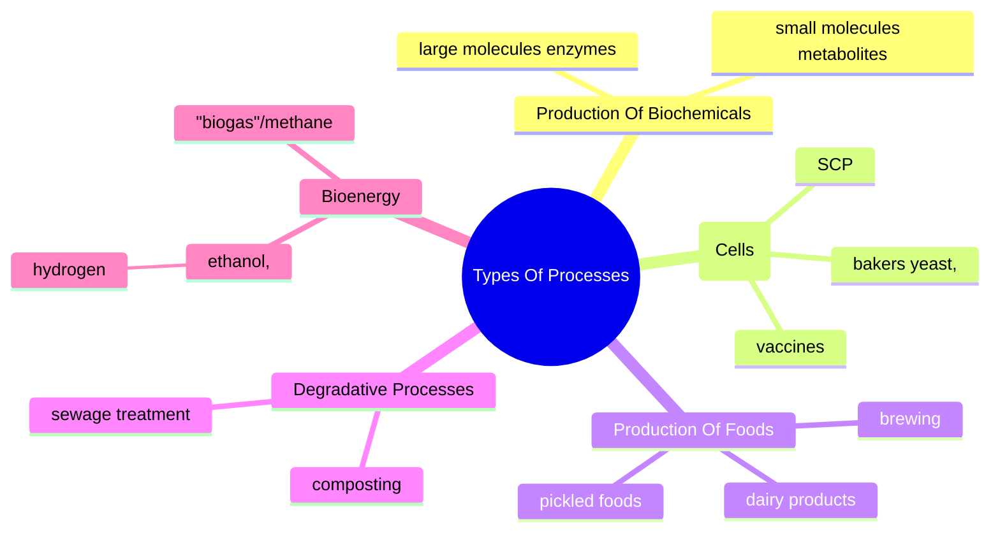
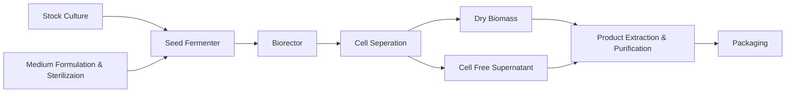

---
{"dg-publish":true,"dg-permalink":"Micro-Biotech","permalink":"/Micro-Biotech/","title":"Microbial Biotechnology","tags":["Tagless"],"dgShowToc":true,"noteIcon":"","dg-note-properties":{"Type":null,"up":["[[Branches/Real UnI Stuff]]"],"down":null,"Yesterday":null,"Tomorrow":null,"Embedded":null,"Next":null,"Previous":null,"aliases":["Microbial Biotechnology"],"title":"Microbial Biotechnology","comments":true,"tags":["Tagless"]}}
---

# 
Microbial Biotechnology

## Week 1 Biotechnology?
The creation of products from raw materials with the aid of living organisms

Biotechnology = bios (life) + logos (study of essence)
Literally: ‘the study of tools from living things’

### Timelines
[](https://mermaid.live/edit#pako:eNptU82OmzAQfpWRL3uhESRpBKjqoe1WW1V766niMjFTYq2x0WBHpdG-e8cEdjdVfcHY4-9v7IvSviVVq2B6ssZRw40DGcEES_BgxuB5Av8LjsYH0ifnre-mtaqoiqq-3YIPR_4ID9F1yAYdkOsElhi-I1u4Z3qaQHvjRggngkDcw90NwN0reFnU8M0F6hiD8e4K_UOOmWWRWogjLfL0iXrRy1MGvdHsZWkWhK6FeU-jfZFjXCco4LkVacED6pOhMy2iFi3zCRwGK5NZgBClAo0DahMMjWnlSibzmSjaEJnGzeoijRruI_uBJI6vJIQvYJ_-Fyps8zxPxtsobgxaM76x_3i1JsJuYzfXQJc4Zk2eO3Rm7Mdk0B8DiuHUEe2dn9OwE5zRRjxKqwf2bdRBEpEsgjmbIMkFQGlW3xPrxCh7FrlL-a_aYBQc2sxd-YdUpLQpY2QCMiKOwaGEgzYTmKOXGORuvRvJkk6d7GNAF8bE0ijnz2QbBR05CovWtXdSK-TiZlSZ6ti0qg4cKVOis8f0qy4pykYJaU-NqmXaIj81qnHPcmZA99P7fj3GPnan9ScOrdyrLwblfr1WkJO2ffbRBVXvqnyGUPVF_Vb1YbupdqWM9_uqzPeHKlOTqot8s9tX2-KwPxRFKZ_nTP2ZOfNNlcu7yctyn--2qShT1BrJ4vH6FOcX-fwXs0M_CA)

#### Putting Microbes To Work
- Traditional biotechnology includes: making bread, cheese, wine, beer and other fermented food products
- 20th century saw the birth of the modern biotechnology industry
	- products include antibiotics and other medicines, enzymes, vaccines, food ingredients

#### The Development Of Biotechnology

[](https://mermaid.live/edit#pako:eNpNkkGP2jAQhf_KyKddKYoSMCFEVSUKqNvDtqtS9VDlYuIhWJt4kO3sNov47zsGsW0OkScev_fNi0-iIY2iEsH02BmLtast8BNM6BDW-IIdHXu0AX7s4YuhgM3BUkfteOvMy1lWwS-ntAmGrOrg6KhB79HDp537DDuHr8a2CfAbE9DKuDGBPbooixr2RNrDHaZtCkfTPHfoE_A0gldDg_cfPouMfb5ZPfjgDNtsnLoabPFVtcgIqELUTGBL3UtkXloNv1XTsDE8OdJDExH_KUpW_IlNbOXt1jH1VXJpg9nxtKZhlo19G_sIteyNJVg2RnOxDejIaHgg15ON9sr6PRcqesQGHpozXGHXRfWAxsLddvX0MdEjR-8srNVYwWpwLmJwcSVgLOp3xqr48fvyP3zOapN-hYehV5bz8AP_t4QXzMOhkr0XiWid0aIKbsBE9Jy0iqU4Rd9ahAP2WIuKl1q551rU9sxnjsr-IepvxxwN7eFWDEetAq6Nap3ijr3qfGxByxOsaLBBVHKxuGiI6iT-iqqYpmUpc5lluSxkKWUiRlFN0nJe5hMp5zM5X-ST4pyIt4tpli6mclpk82kxLWa8UyQC-UqRe7ze0MtFPb8DXBriNQ)

### Types Of Processes
[](https://mermaid.live/edit#pako:eNp1ksFu2zAMhl9F4CkFjCxOajvxcSl6K1ZgOw2-MBbrCJFEQ5LbuUHefYqDziqKCTAg8v9IWr90hpYlQQ1GWWmwb1xjhXDMYbH4NfbkxY8X8ey4Je_J393d9LhiTg5tUGyvxHfF7ZGMalH7f4g3qLUwrKkddOwkDAU8sFaBZkij6yiFyL6PZga-zDHovVjsSWs__01cBzyR82Ik9CFLhZ_75zR8xbZV9n8DHpmlT3GJyo2iv0GflIOjN2W7NNWr9qRJipe0ywN1DiUG9Uqzk2mVpzeMHgRHGAzZkGotm559SOZEC8iS68YUa-CguEPfwLdo8hEtpeqUYf3JFXEcpeOOLGTQOSWhDm6gDAw5g9cQzle4gRDvlRqo41aiOzXQ2Eus6dH-ZjYfZY6H7vgRDH08Lj0ojAefCbKS3J4HG6AuyvXUAuoz_IE6r4plsVuXRb4pq3xbFRmMUJe7ZVluq1WeT7lLBu_TxNXyvig21Sp-m939drtdR56kCuyebo95etOXvyig5xE)
#### Production Of Biochemicals
- small molecules - metabolites
- large molecules - enzymes
#### Production Of Biomass (Cells)
- bakers yeast,
- SCP
- vaccines
#### Production Of Foods
- dairy products
- brewing
- pickled foods
#### Degradative Processes
- sewage treatment
- composting
#### Bioenergy
- "biogas"/methane
- ethanol,
- hydrogen

### Reasons Microorganisms Are Used In Biotechnology
- Readily grown under controlled conditions
- Very rapid growth and metabolic rates
- Products of high purity and high yield
- Higher yielding strains readily developed by e.g. mutation + possibilities of genetic engineering
- As a group, microorganisms will carry out a vast range of processes, many of which are unique
	- ( ie. no feasible alternative method exists )

### Nutritional and cultural requirements for the growth of microorganisms

"Product" - commercially valuable product (e.g. amino acids to improve food taste, quality or preservation, enzymes, vitamins or pigments, hydrogen, ect.)
The microbe is the key factor to the process - an essential reactant

### Basic principles of industrial processes
- Growth of microbial cells
	- CHONPS (Carbon, Hydrogen, Oxygen, Nitrogen, Phosphorus, Sulphur) and trace elements
		- SUBSTRATE → PRODUCT
- Environmental conditions
	- temperature, oxygen, pH, light
- Equipment
	- growth vessel = fermenter
		- fermentation

### Fermenter & associated process
- made of materials able to withstand high pressure and temperature
- material used is selected according to the nature of the process
- resistant to corrosion

### Sterilisation and fermentation
During fermentation the following points must be observed to ensure sterility:
- sterility of the culture media
- sterility of incoming and out coming air
- appropriate construction of the bioreactor for sterilisation and for prevention of contamination

### Stirred tank reactor (STR) or Stirred tank fermenter (STF)
STR has mechanically moving impellers within baffled cylindrical vessel Whereas The STF Has No Moving Internals

STR/STF

<?xml version="1.0" encoding="UTF-8"?><svg xmlns="http://www.w3.org/2000/svg" xmlns:xlink="http://www.w3.org/1999/xlink" viewBox="0 0 850 1000">  <defs>    <marker id="l" orient="auto" overflow="visible">      <path stroke="#000" stroke-width=".8pt" d="M3.92 0c0 2.208-1.792 4-4 4s-4-1.792-4-4 1.792-4 4-4 4 1.792 4 4z"/>    </marker>    <linearGradient id="c">      <stop offset="0" stop-color="#e86f43"/>      <stop offset="1" stop-color="#eedd3e"/>    </linearGradient>    <marker id="h" orient="auto" overflow="visible">      <path stroke="#000" stroke-width=".8pt" d="M-10 0l-4 4L0 0l-14-4 4 4z"/>    </marker>    <linearGradient id="b">      <stop offset="0" stop-color="#85b1c1"/>      <stop offset=".386" stop-color="#fff"/>      <stop offset="1" stop-color="#85b1c1"/>    </linearGradient>    <linearGradient id="a">      <stop offset="0" stop-color="#85b1c1"/>      <stop offset=".5" stop-color="#fff"/>      <stop offset="1" stop-color="#85b1c1"/>    </linearGradient>    <linearGradient id="f" x1="141.002" x2="430.965" y1="266.17" y2="309.678" gradientTransform="matrix(.91506 0 0 1.02188 -2.063 13.807)" gradientUnits="userSpaceOnUse" xlink:href="#a"/>    <linearGradient id="d" x1="141.002" x2="403.523" y1="289.597" y2="307.651" gradientTransform="matrix(.91394 0 0 1.0013 -1.922 44.48)" gradientUnits="userSpaceOnUse" xlink:href="#a"/>    <linearGradient id="e" x1="197.8" x2="513.622" y1="229.522" y2="285.126" gradientTransform="matrix(1.01239 0 0 1.12785 -35.796 -13.365)" gradientUnits="userSpaceOnUse" xlink:href="#b"/>    <linearGradient id="g" x1="141.002" x2="403.523" y1="289.597" y2="307.651" gradientTransform="matrix(.02757 0 0 19.5013 444.136 -5208.25)" gradientUnits="userSpaceOnUse" xlink:href="#a"/>    <linearGradient id="i" x1="390.246" x2="550.474" y1="804.391" y2="399.687" gradientTransform="translate(-33.584 17.934)" gradientUnits="userSpaceOnUse" xlink:href="#c"/>    <linearGradient id="j" x1="390.246" x2="550.474" y1="804.391" y2="399.687" gradientTransform="matrix(-1 0 0 1 688.987 17.829)" gradientUnits="userSpaceOnUse" xlink:href="#c"/>    <linearGradient id="k" x1="141.002" x2="430.965" y1="266.17" y2="309.678" gradientTransform="matrix(.19804 0 0 2.62662 255.416 -681.677)" gradientUnits="userSpaceOnUse" xlink:href="#a"/>  </defs>  <g fill="none" stroke="#000" stroke-width="1.5">    <path d="M150.381 737.972V342.347"/>    <path d="M508.422 734.015V338.391"/>  </g>  <path fill="none" stroke="#5eb6d9" stroke-width="1.352" d="M155.402 465.858c25.763 13.282 28.861 12.427 44.611 11.472 15.78-.957 29.199-12.248 44.612-12.255 15.413-.006 18.04 11.543 44.612 12.255 26.58.712 30.224-11.95 44.612-12.255 14.388-.304 27.063 12.112 44.612 12.255 17.548.142 20.98-12.057 44.611-12.255 23.623-.198 24.816 11.476 44.612 12.255 19.796.778 44.388-15.943 44.612-11.696"/>  <path fill="#638fff" fill-opacity=".385" d="M297.503 817.735c-81.045-4.745-138.233-30.821-146.367-66.739-1.271-5.614-.87-6.807 2.786-8.281 3.392-1.368 3.559-1.749.81-1.849-3.262-.118-3.461-8.033-3.461-137.495V466l11.374 5.315c15.543 7.264 33.465 7.13 52.915-.398 18.08-6.997 28.556-7.046 43.187-.203 16.85 7.882 34.665 7.551 54.623-1.013l14.728-6.32 18.894 6.451c22.597 7.715 30.897 7.861 46.599.82 16.587-7.439 31.623-7.467 47.49-.088 15.978 7.43 29.161 7.296 49.241-.5l15.033-5.838v138.257c0 130.267-.2 138.27-3.462 138.486-3.297.219-3.297.273 0 1.135 7.113 1.858 2.36 17.014-9.427 30.06-28.9 31.989-108.632 50.625-194.963 45.57zM170.52 741.348c-1.925-.501-4.595-.468-5.935.074-1.339.541.236.952 3.5.912 3.264-.04 4.36-.484 2.435-.986zm15.825 0c-1.925-.501-4.595-.468-5.935.074-1.339.541.236.952 3.5.912 3.264-.04 4.36-.484 2.435-.986zm15.825 0c-1.925-.501-4.595-.468-5.935.074-1.339.541.236.952 3.5.912 3.264-.04 4.36-.484 2.435-.986zm15.825 0c-1.925-.501-4.595-.468-5.935.074-1.339.541.236.952 3.5.912 3.264-.04 4.36-.484 2.435-.986zm15.825 0c-1.925-.501-4.595-.468-5.935.074-1.339.541.236.952 3.5.912 3.264-.04 4.36-.484 2.435-.986zm15.825 0c-1.925-.501-4.595-.468-5.935.074-1.339.541.236.952 3.5.912 3.264-.04 4.36-.484 2.435-.986zm15.825 0c-1.925-.501-4.595-.468-5.935.074-1.339.541.236.952 3.5.912 3.264-.04 4.36-.484 2.435-.986zm15.825 0c-1.925-.501-4.595-.468-5.935.074-1.339.541.236.952 3.5.912 3.264-.04 4.36-.484 2.435-.986zm16.852.061c-1.36-.549-3.586-.549-4.946 0-1.36.549-.247.998 2.473.998 2.72 0 3.832-.45 2.473-.998zm16.776-.06c-1.925-.502-4.595-.47-5.934.073-1.34.541.235.952 3.499.912 3.264-.04 4.36-.484 2.435-.986zm15.825 0c-1.925-.502-4.595-.47-5.934.073-1.34.541.235.952 3.499.912 3.264-.04 4.36-.484 2.435-.986zm15.825 0c-1.925-.502-4.595-.47-5.934.073-1.34.541.235.952 3.499.912 3.264-.04 4.36-.484 2.435-.986zm15.825 0c-1.925-.502-4.595-.47-5.934.073-1.34.541.235.952 3.499.912 3.264-.04 4.36-.484 2.435-.986zm15.825 0c-1.925-.502-4.595-.47-5.934.073-1.34.541.235.952 3.499.912 3.264-.04 4.36-.484 2.435-.986zm15.825 0c-1.925-.502-4.595-.47-5.934.073-1.34.541.235.952 3.499.912 3.264-.04 4.36-.484 2.435-.986zm15.825 0c-1.925-.502-4.595-.47-5.934.073-1.34.541.235.952 3.499.912 3.264-.04 4.36-.484 2.435-.986zm15.825 0c-1.925-.502-4.595-.47-5.934.073-1.34.541.235.952 3.499.912 3.264-.04 4.36-.484 2.435-.986zm15.825 0c-1.925-.502-4.595-.47-5.934.073-1.34.541.235.952 3.499.912 3.264-.04 4.36-.484 2.435-.986zm15.825 0c-1.925-.502-4.595-.47-5.934.073-1.34.541.235.952 3.499.912 3.264-.04 4.36-.484 2.435-.986zm16.852.06c-1.36-.549-3.586-.549-4.946 0-1.36.549-.247.998 2.473.998 2.72 0 3.833-.45 2.473-.998zm15.825 0c-1.36-.549-3.586-.549-4.946 0-1.36.549-.247.998 2.473.998 2.72 0 3.833-.45 2.473-.998z" opacity=".279"/>  <g fill="#85b1c1" stroke="#000" stroke-linecap="round" stroke-width="2">    <path d="M225.55 612.855h79.125v65.278H225.55z"/>    <path d="M346.215 612.855h79.125v65.278h-79.125z"/>  </g>  <g fill="none" stroke="#000" stroke-width="3">    <path d="M259.178 643.022h132.534"/>    <path d="M327.918 91.348v549.473"/>  </g>  <g stroke="#000" stroke-linecap="round" stroke-width="2">    <path fill="url(#d)" d="M126.945 334.452v-11.884H524.68v23.768H126.945v-11.884z"/>    <path fill="url(#e)" d="M153.703 290.954c16.675-16.31 53.211-31.56 97.44-40.67 19.868-4.092 30.593-4.748 78.102-4.78 47.926-.033 58.09.585 78.325 4.764 41.576 8.585 80.592 25.891 93.75 41.583l4.855 5.79H146.867l6.836-6.687z"/>    <path fill="url(#f)" d="M126.963 309.74v-12.13h398.221v24.258H126.963V309.74z"/>    <path fill="#85b1c1" d="M154.337 377.458h23.737v350.128h-23.737z"/>    <path fill="#85b1c1" d="M476.772 377.458h23.737v350.128h-23.737z"/>  </g>  <path d="M327.719 820.344v80.531h1.375v-80.531h-1.375z"/>  <path stroke="#000" stroke-width="1.467" d="M328.412 887.116l-5.502-5.503 5.502 19.26 5.503-19.26-5.503 5.503z"/>  <path d="M454.375 137.844v66.781h1.281v-66.781h-1.281z"/>  <path stroke="#000" stroke-width="1.346" d="M455.012 192.01l-5.048-5.048 5.048 17.668 5.048-17.668-5.048 5.048z"/>  <path fill="url(#g)" stroke="#000" stroke-linecap="round" d="M448.024 439.275V207.819h11.999v462.912h-12V439.275z"/>  <g fill="none" stroke="#000" stroke-dasharray="7.8,7.8" stroke-width="1.3" marker-end="url(#h)" transform="translate(-31.606 15.956)">    <path d="M487.077 670.662c-3.968 30.746-10.818 54.906-38.586 68.35"/>    <path d="M437.31 741.102c-49.985 10.899-59.237-18.73-66.601-51.703"/>    <path d="M286.26 741.265c49.985 10.899 59.237-18.73 66.6-51.704"/>    <path d="M248.297 640.412c-45.003 26.375-26.513 71.751 20.223 92.836"/>    <path d="M244.423 623.063c-45.003-26.374-32.447-77.685 20.223-92.835"/>    <path d="M473.524 623.938c27.2-18.462 26.513-71.751-20.222-92.836"/>    <path d="M434.936 526.664c-49.985-10.899-59.237 18.73-66.601 51.704"/>    <path d="M283.886 526.502c49.985-10.9 59.237 18.73 66.6 51.703"/>  </g>  <path fill="none" stroke="#000" stroke-width=".768" marker-end="url(#h)" d="M299.726 144.3c-24.676 63.334 82.318 73.076 56.75-.284"/>  <path fill="url(#i)" stroke="#000" stroke-linecap="round" stroke-width="2" d="M328.968 832.038v-12.046h11.45c6.296 0 21.652-1.283 34.122-2.851 69.312-8.716 113.89-29.274 128.38-59.205 4.032-8.33 4.08-10.578 4.08-195.725V374.914h23.736l-.137 164.679c-.075 90.573-.797 177.678-1.604 193.566-1.308 25.757-2.052 30.082-6.862 39.913-6.792 13.882-23.825 29.873-41.983 39.415-31.906 16.766-71.825 25.812-133.875 30.335l-17.308 1.262v-12.046z"/>  <path fill="url(#j)" stroke="#000" stroke-linecap="round" stroke-width="2" d="M326.434 831.933v-12.047h-11.45c-6.296 0-21.651-1.283-34.122-2.85-69.311-8.716-113.89-29.274-128.379-59.205-4.033-8.331-4.08-10.579-4.08-195.726V374.808h-23.737l.136 164.68c.075 90.572.797 177.677 1.604 193.565 1.309 25.757 2.052 30.082 6.862 39.914 6.792 13.881 23.825 29.873 41.983 39.414 31.906 16.766 71.826 25.812 133.875 30.336l17.308 1.262v-12.046z"/>  <path fill="url(#k)" stroke="#000" stroke-linecap="round" stroke-width="1.492" d="M283.341 78.986V47.811h86.186v62.35h-86.186V78.986z"/>  <g fill="none" stroke="#000" stroke-width="2" marker-start="url(#l)">    <path d="M298.644 92.31l-87.08 38.784"/>    <path d="M521.904 403.21L585 360"/>    <path d="M488.737 521.89L585 480"/>    <path d="M409.894 657.805L585 600"/>  </g>  <g font-family="Arial, sans-serif" font-size="32">    <switch transform="translate(130 160)">      <text systemLanguage="en">Motor</text>      <text systemLanguage="it">Motore</text>      <text systemLanguage="te">ఇంజను</text>      <text>Motor</text>    </switch>    <switch transform="translate(470 160)">      <text systemLanguage="en">Feed</text>      <text systemLanguage="it">Alimentazione</text>      <text systemLanguage="te">సారం</text>      <text>Feed</text>    </switch>    <switch transform="translate(590 370)">      <text systemLanguage="en">Cooling jacket</text>      <text systemLanguage="it"><tspan x="0" y="-20">Camicia di</tspan> <tspan x="0" dy="40">raffreddamento</tspan></text>      <text systemLanguage="te"><tspan x="0" y="-20">శీతలీకరణ</tspan><tspan x="0" y="20">జాకెట్</tspan></text>      <text>Cooling jacket</text>    </switch>    <switch transform="translate(590 490)">      <text systemLanguage="en">Baffle</text>      <text systemLanguage="it"><tspan x="0" y="-20">Setto</tspan> <tspan x="0" dy="40">frangivortice</tspan></text>      <text systemLanguage="te">భంగపుచ్చు</text>      <text>Baffle</text>    </switch>    <switch transform="translate(590 610)">      <text systemLanguage="en">Agitator</text>      <text systemLanguage="it"><tspan x="0" y="-20">Paletta</tspan> <tspan x="0" dy="40">dell&apos;agitatore</tspan></text>      <text systemLanguage="te">సంక్షోభిని</text>      <text>Agitator</text>    </switch>    <switch text-anchor="middle" transform="translate(328 940)">      <text systemLanguage="en">Mixed product</text>      <text systemLanguage="it">Miscela</text>      <text systemLanguage="te">మిశ్రమ ఉత్పత్తి</text>      <text>Mixed product</text>    </switch>  </g></svg>
Schematics of an agitated vessel with a Rushton turbine and baffles

### Common measurements and control systems in fermenters

#### Temperature control
- Critical for optimum growth

#### Gas supply/Aeration
- Related to flow rate and stirrer speed
- Dependent on temperature

#### Mixing
- Depends on fermenter dimensions, paddle design and flanging
- Control aeration rate
- May cause cell damage (shear)

#### pH control
- Important for culture stability/survival

#### Foaming control
- Prevents culture losses and contamination

### Agitation in STR
Agitation is performed in order to mix all three phases within fermenter:
- liquid (dissolved nutrients and metabolites)
- solid (cells and any solid substrates)
- gas (oxygen and carbon dioxide)

This Is Done in order to produce homogeneous condition and promote nutrient, gas and heat transfer.

#### Agitation/mixing
Mixing (agitation) is important for oxygen transfer into liquid from the gas phase, because It:
- reduces bubble size to increase oxygen transfer
- prolongs retention of air bubbles in suspension
- decrease film thickness at the gas-liquid interface

Structural components involved :
- the agitator
- stirrer glands and bearings
- baffles & the aeration system

The efficiency of mixing (stirring) is determined by: 
- the fluid properties
- shape & dimensions of the vessel 
- impellers.

### Basic functions of a fermenter
- provides a controlled environment for the growth of an organism to obtain a desired product
- capable of aseptic operation for a number of days
- adequate aeration and agitation
- low power consumption
- temperature and pH control
- sampling facilities
- minimal evaporation losses
- suitable for a range of processes
	- STR not suitable for fragile cells
- design for minimum labour in operation, harvesting, maintenance and cleaning
- construction - smooth internal surfaces ( glass, stainless steel)
- adequate service provision
- geometry - similar for smaller / larger FV’s within plant, facilitates scale-up

### Chemical engineering process
- Upstream processing
- Fermentation
	- types of fermenters (bioreactors)
	- mode of operation : batch or continuous culture
	- instrumentation and control, environmental optimisation (sensors)
- Downstream processing
	- product extraction and purification
- Ancillary equipment

### A schematic representation of typical fermentation process

### Fermenter & associated process equipment
Bacterial cells: 
- generally robust and readily growth ; many possible systems

Plant/animal cells:
- fragile, less adaptable, slow growth; modify systems to suit

Photosynthetic cells:
- special requirement for light

### Batch Fermenter
Batch fermentation is what is described as a 'closed system

 - In batch fermentation, all nutrients necessary for cell growth and product production are present in the medium from start at zero time.
- The batch fermentation starts by inoculation with biomass from a culture starter (seed reactor)
- The batch process is finished when nutrients (mostly carbon source) have been used by biomass.
- A disadvantage - only a limited amount of the carbon source can be used.
- This will limit production of the useful product in the process.

### Characteristics of Fed Batch Fermenters

DOT: dissolved oxygen tension

- Initial medium concentration is relatively low (no inhibition of culture growth)
- Medium constituents (concentrated C and/or N feeds) are added continuously or in increments
- Controlled feed results in higher biomass and product yields
- Fermentation is still limited by accumulation of toxic end products

### Characteristics of Continuous Fermenters
- Input rate = output rate (volume = const.)
- Flow rate is selected to give steady state growth
	- Dilution rate > Growth rate → culture washes out
	- Dilution rate < Growth rate → culture overgrows
	- Dilution rate = Growth rate → steady state culture

- Product is harvested from the outflow stream
- Stable chemostat cultures can operate continuously for weeks or months.

### Fermenter design
“the design of a fermenter to carry out a fermentation in an efficient and predetermined manner is the most important objective function of fermentation engineering”

### Stirred tank reactor (STR)
- Have mechanically moving impellers within baffled cylindrical vessel
- Must create high turbulence to maintain transfer rate
- Unsuitable for many animal and plant (fragile) cells or filamentous microbes

### Production of mycophenolic acid by Penicillium brevicompactum immobilized in a rotating fibrous-bed bioreactor (RFB)
Fungal morphology observed in free-cell stirred-tank (STF) and immobilized-cell rotating fibrous-bed (RFB) fermentations:

STF:
- fungal mycelia grew everywhere
- large clumps of biomass was attached to the agitation shaft, pH and DO probes, reactor wall

RFB:
- all fungal mycelia were attached to the rotating fibrous matrix, forming a homogeneous biofilm,
- fermentation broth was clear.

### Z®RP bioreactor
- Rotating bed system in which the cell are cultured in a continuous process.
- Optimal culture conditions are generated by regulation of cell culture parameters and cells grow under near physiological conditions.
- Sponceram® carrier materials are suited for culturing anchorage-dependent cell
- Used for:
	- stem cells,
		- tissue engineering
- http://www.zellwerk.biz/prod_impl_en.html

Small Fermenters Produce Less Waste

#### Z®RP Implant Blanks

A - SEM capture of chondrocytes in ECM, long-term culture on
Sponceram® HA surface (5000-times magnification)- skin-like tissue
B- Cartilage layer, grown in vitro on Sponceram® HA cell carrier
(courtesy of TU Hamburg-Harburg) - bone-like
Blanks Support Growth In The Shape You Need

### [[Uni/3/6AB023 Microbial Biotechnology/Microbial Biotechnology#Stirred tank reactor (STR)\|STR Again]]
### Airlift fermenters
- Tall, thin vessel, sometimes conical at the top
	- the widest area used for gas exchange
- The system has no moving parts.
	- Shaft And Propellor Gone
	- gas bubbles initiate the upward movement (mixing and aeration)
	- low risk of contamination
- Lower energy requirements
- Do not required internal cooling system
- Used in large scale manufacture of biopharmaceutical products e.g. monoclonal antibodies obtained from fragile, shear-sensitive cells.
- Hollow pipe or riser in the tube for the air to move upwards to the top of the vessel
- At the top the draft tube the aerated fluid/culture ‘spills over’ and starts to fall towards the bottom
- The space above the draft tube allows for easy gas transfer from the liquid to the gas phase
	- the specific gravity of the liquid increases
	- liquid returns to the bottom of the vessel to be re-gassed
	- liquid begins to rise again

a) draft-tube configuration, b) a split cylinder device, c) an external loop system

### Photobioreactors

#### Scale-up of Oldenlandia affinis cultures in air-lift photobioreactors
- Plants are source of a large number of useful pharmaceuticals.
- Cyclotides are di-sulfide rich mini-proteins with broad range of biological activity such as anti-HIV, cytotoxic and antimicrobial.
- The major problems hindering the development of large-scale cultivation of plant cells include:
	- low productivity, cell line instability
- Shake flask cultures are used, but industrial fermentation of natural products requires highly reproducible conditions.
- Need for scale-up and fermenter.

#### Photobioreactors for cyclotide production
- The bubble column was operated at 800 ml working volume.
	- O. affinis suspension culture started to foam after three days and plant cells adhered to the glass tube of the reactor.
- Adhesion is correlated with excretion of polysaccharides That Are Poduced
- Cell adhesion was also observed in the loop system
- The cultures in the air-lift loop bioreactor showed:
	- a considerably higher growth due to controlled and improved light supply
	- increased synthesis of chlorophyll, the supposed prerequisite for peptide synthesis.

The design of bioreactor is a very important factor!

### Environmental monitoring and control
- The success of fermentation depends upon the existence of defined environmental conditions for biomass production and product formation.
- We need to know how to obtain optimal operating conditions.
- It is necessary to keep: temperature, pH, agitation, oxygen concentration in the medium and other factors constant during the process using a suitable control system e.g. sensors/ biosensors.

#### SENSORS

##### Physical sensors
- thermistor
- gas flow meter
- tachometer
- foam sensor
##### Chemical sensors
- pH meter
- DO electrode (dissolved oxygen)
- CO2 analyser
- oxygen analyser
- NAD analyser
 Biosensor - a sub group of chemical sensors.

##### Linearity
###### In-line
- an integrated part of the fermentation equipment, obtained data are used directly for process control

###### On-line
- an integrated part of the fermentation equipment, direct measurement of fermentation parameters, the measured value cannot be used directly for control, an operator required for entering the data into the control system e.g. gas analyser
###### Off-line
- not part of the fermenter, requires sampling, the measured value cannot be used directly for control, operator needed for measurement and entering the data into the control panel
	- e.g. sample for spectrophotometric analysis

Real-time → instant, as it happens
### Computers applications in fermentation biotechnology
- Process control
	- timed series of operations e.g. sterilisation, medium addition, inoculation
- Data logging (e.g. printer, data store, graphics)
- Alarms
- Environmental control (e.g. pH, temperature)
- Dynamic optimisation
	- Active, instant response to the sensed environment to maintain environmental and physiological conditions at optimal levels to maximise culture productivity.
- Modelling of fermentations

### Foaming

 Foaming is caused when:
- microbial cultures excrete high levels of proteins and/or emulsifiers
- high aeration rates are used

Excess foaming causes loss of culture volume and may result in culture contamination

Foaming is controlled by use of a foam-breaker and/or the addition of anti-foaming agents (silicon-based reagents)

#### SPINNING CONES AS FOAM CONTROLLERS

#### Temperature control
- Heat supplied by direct heating probes or by heat exchange
- Microbial growth is very sensitive to temperature changes - accurate temperature feed-back control is required
- Fermentations are exothermic - cooling may be required

#### pH control
- Most cultures have narrow pH growth ranges
- The buffering in culture media is generally low
- Most cultures cause the pH of the medium to rise during fermentation
- pH is controlled by using a pH probe, linked via computer to NaOH and HCl input pumps.

### Biosensor
Constructed device which employs biologically active material which provides specific recognition of the target analyte, to a transducer, which generates electrical signal directed to a digital reader/control system.

Bioactive components
- Enzymes
- Monoclonal antibodies
- Cells
- microorganisms
- tissues
- Nucleic acids

Measuring devices comprising a biological element (e.g.
enzyme, antibody, microorganism) connected or integrated
to a physical or chemical transducer

Advantages:
- high selectivity
- high specificity
- relative low cost
	- reduce assay time
	- can increase product safety
- small size
- on-line control of the fermentation process

Restrictions:
- optimal pH
- optimal temperature

#### Biosensor in monitoring and control

#### Immobilised enzyme biosensor
- Porous polycarbonate layer, limits the diffusion of the substrate into the second Immobilised Enzyme Layer, preventing the reaction becoming enzyme-limited
- The third layer, cellulose acetate, permits only small molecules, such as hydrogen peroxide, to reach the electrode
- The substrate is oxidised, in the enzyme layer, producing hydrogen peroxide, oxidised on platinum electrode
- The resulting current is proportional to the concentration of the substrate

#### Penicillin biosensor

### Transducer
A physical element which converts the stimulus generated by the bioactive layer to an electrical
signal.

Can Be:
- Electrochemical
- amperometric
- potentiometric
- Optical
- Mechanical
- Thermal

It may detect:
- a redox reaction
- light emission
- changed levels of ions
- luminescent/fluorescent signal
- a change in mass associated with surface

## Week 2 Biodegradable Polymers.  

### Terminology

##### Polymer
are large molecules (macromolecules)  composed of many repeated sub-units (monomers)  

##### homopolymer
Only one subunit 
E.G -A-A-A-A-A-  

##### heteropolymer (co-polymer) 
Multiple subuinits 
E.G -A-B-B-A-C-  

##### Biopolymer 
polymer made from natural resources E.G Starch

##### Bioplastic
large family of different materials (either biobased, biodegradable or both)  
if biodegradable, it must be degraded completely, to only  natural biogenic compounds such as water, CO2, biomass  

##### Biobased
material derived from biomass - renewable resources, not from fossil oil  

##### Biodegradable
able to decay naturally and in a way that is not harmful
Biodegradability depends on the chemical structure of the material 

### Polymeric Materials
Classification by susceptibility to microorganism/enzymatic attack:  

#### Non-biodegradable  
(polyethylene – PE, polypropylene – PP,  polystyrene – PS)  

#### Biodegradable  
(polylactide – PLA, regenerated cellulose, starch, bacterial polymers)

### Polymers and plastics  
Plastics are materials formulated and prepared for use  
The main components of plastics are the polymers with additives  

### Biopolymers & Microbes

#### Which biopolymers should be produced ?
- Currently only a few biopolymers can compete with their petrochemical equivalents  
	- based on price & performance  
- Bacterial cellulose (BC), Poly-glutamic acid (PgGA) Poly-hydroxyalkanoates (PHA) and Poly-lactic acid (PLA) are good examples of biopolymers that could capture a substantial part of the bioplastic market  
#### What is poly-γ-glutamic  
- Polymer of glutamic acid residues.  
	- unusual anionic polypeptide in which D and/or L-glutamate is polymerized via γ-amide linkages  
- Non-toxic, non-immunogenic and edible  

Anthrax Capsule Made From Glutamic Acid
##### Applications of γ-PGA

###### FOOD  
- Cryoprotectant  
- Bitterness relieving agent  
- Thickener  
- Humectant  
- Properties of wheat dough  

###### MEDICAL  
- Drug delivery  
- Nanoparticles  
- Biological adhesive  
- Biodegradable scaffold  
- Anti-mutagenic agent  

###### OTHER  
- Waste water treatment  
- Cosmetics  
- Diapers  
 

### Analysis  

Salt/Acid form of γ-PGA (ICP)  
Yield (g/l)  
Crystallinity (XRD)  
Identification (FTIR, NMR)  
Molecular weight (GPC)

#### Yield

#### XRD

#### Molecular weight  

#### Medium E

#### Medium GS

#### Hemolytic activity
 

#### Lecithinase activity

#### PCR of genes encoding toxins

#### Probiotics  
Live microorganisms that when administered in adequate amounts confer a health benefit on the host

#### Maintaining viability of ‘friendly’ bacteria
Freeze drying 
Storage 
Ingestion  

#### Viability of B. breve in simulated gastric juice (Free cells and polymer protected cells)  

### Cancer therapies  

Use of oncolytic adenovirus coated with γ- PGA for effective and safe cancer therapy.
Smart Adenovirus Nano complexes as a Therapeutic Vehicle

#### Oncolytic Ad  
- preferentially infects and kills cancer cells 

##### Limitations
- Immune response  
- High liver tropism  
- Lack of tumour tropism upon systemic delivery  

##### Modification of Ad is needed to:  
- increase retention time in the blood  
- avoid accumulation in the liver

###### Ionic-gelation Method  
Encapsulation efficiency 93%  

###### HEK 293 cells
- Visible clear attachment and/or internalisation of NPs  
- PGA can boost cellular uptake possibly through a specific receptor-mediated pathwayFITC-labelled γ-PGA-chitosan NPs  

### Xerostomia, acidic drinks and bacterial  PGA  
- Salivary phosphoproteins protect the enamel from acid dissolution and acting as a reservoir for free calcium ions  
- A reduction in salivary flow leads to a prolonged dry mouth, known as xerostomia  
- Xerostomia include severe dental hard tissue destruction, leading to a clinical condition termed “rampant dental caries”  
The biochemical and physical properties of ɣ-PGA suggest its suitability as an anti-cariogenic agent, and a therapeutic treatment for rampant caries associated with xerostomia

#### Protection of tooth enamel project  
Microbial polymer of γ-PGA tested showed an excellent inhibitory effect on the dissolution rate of  
calcium ions form teeth enamel  

#### Brown Algae as a Valuable Substrate for the Cost- Effective γPGA for Applications in Cream Formulations  
- Successful incorporation of seaweed-derived γ-PGA (0.2–2 w/v%) was achieved for several model cream systems with absorbances reported at 300 and 400 nm.  
-  Seaweed-derived γ-PGA cream systems did not display any negative effect on model HaCaT keratinocytes by means of in vitro MTT  

#### Can γ-PGA help fight Parkinson’s ?  
- γ-PGA has previously demonstrated anti inflammatory/antioxidative properties and has shown to alleviate neuronal cell death  
- Can γ-PGA reverse cytotoxic effect and cellular inflammation?  
- Can γ-PGA be explored as a potential therapeutic molecule in the context of α-synuclein pathology?

#### Can microbes help fight Parkinson’s ?  
- Parkinson’s disease (PD) affects around ten million people worldwide  
- PD is the second most widespread neurodegenerative disease after  
- PD pathology is characterized by a loss of dopaminergic neurons and the development of lewy bodies - proteins, mainly α-synuclein.
- α-synuclein during stress or degeneration can be released into extracellular environment and can be taken up by neurons and astrocytes  
- astrocytes normally are involved in clearance of α-synuclein, therefore protect neurones, however their capacity is limited  
- extensive uptake leads to cellular toxicity and inflammation and astrocytes loose protective role

#### γ-PGA as a chelator of protein accumulation  
Alzheimer's disease, Parkinson's diseases, amyotrophic lateral sclerosis, dementia with Lewy bodies, frontotemporal dementia, Huntington's disease, amyloid transthyretin cardiomyopathy are all Protein aggregation diseases  

#### γ-PGA limits the extent of α-synuclein PFFs in primary astrocytes  
γ-PGA has a marked inhibitory effect on astrocyte ability to internalize α- synuclein PFFs, leading to reduced cellular toxicity  

#### Problems with synthetic plastics  
- Plastics litter oceans and the coastlines  
- Plastics use valuable/limited oil resources  
- Some plastics leach small amounts of pollutants, that are toxic to life  
- PE the most manufactured pertochemical polymer (29% of global production)  
- Only 10% recycled !  

#### Microbial bioplastic  
- Are produced bacteria as a carbon and energy storage material  
- Synthesized as intracellular granules  
- Accumulated as a result of nutrient limitation in the presence of excess supply of carbon source 

#### Microbial polyhydroxyalkanoates (PHA)
- Are produced by bacteria as a carbon and energy storage material  
- Synthesized as intracellular granules  
- Accumulated as a result of nutrient limitation in the presence of excess supply of carbon source 

#### Polyhydroxyalkanoates (PHAs)  
- Are produced bacteria as a carbon and energy storage material  
- Synthesized as intracellular granules  
- Accumulated as a result of nutrient limitation in the presence of excess supply of carbon source 

#### Bacterial PHB  
- Homopolimer -A-A-A-A-A-  
- White crystalline powder with isotactic structure  
- High molecular weight and melting point (~180 oC)  
- Biodegradable and non-toxic  
- BUT rather brittle  

Copolymers -A-A-A-B-B-A-C-  
- different monomers, almost always 3-hydroxy fatty acids  
- BUT may also contain 4-, 5- and 6- hydroxy fatty acids or monomers with aromatic rings  

- Mixed carbon sources needed

##### Biomaterial properties

| Parameter                  | PHB | PHBV | PHBHx | PP    |
| -------------------------- | --- | ---- | ----- | ----- |
| Melting temperature (°C)   | 177 | 145  | 127   | 176   |
| Glass transition temp (°C) | 2   | -1   | -1    | -10   |
| Crystallinity (%)          | 60  | 56   | 34    | 50-70 |
| Tensile strength (MPa)     | 43  | 20   | 21    | 38    |
| Extension to break (%)     | 5   | 50   | 400   | 400   |

##### Where has it been applied?  
###### AGRICULTURE  
- mulch films  

###### MEDICAL
- biodegradable scaffolds  
- controlled antibiotic release systems,  
- implants, sutures  
- heart valves  
- bone graft substitutes  

###### OTHER  
- Packaging  
- Coatings  
- Car industry  
- Textiles

#### Bacterial bioplastics from waste cooking oil  
Waste cooking oil → Bacteria with PHA → granules Bioplastics!  
‘Work by a research team at the University of Wolverhampton suggests that using  
waste cooking oil as a starting material for the production of bioplastic can  
reduce production costs significantly…’  

#### Electrospun Fibres of Polyhydroxybutyrate Synthesized by Ralstonia eutropha from Different Carbon Sources  

#### PHA as biomaterials  
- biomedical/pharmaceutical areas have been approved by FDA in 2007  
- PHAs are biodegradable, biocompatible, they are used to produce microspheres, microcapsules, and nanoparticles, films and porous matrices  
- their degradation products are non toxic  
- drug release from the polymeric material occurs through osmosis, diffusion or biodegradation mechanism  
	- release depends on composition of the composition of PHA

#### 3D printed PLA/PHA filaments  
Vertical specimens have improved mechanical properties compared to horizontal specimens,  
MTT assay with HEK293 shows the horizontally printed specimen tended to produce more growth from day 4 onwards.  

#### PHA applications  
- Regenerative medicine  
- Bio-implants  
- 3D printing material  
- Surgical stitching and coronary stents  
- Time release capsules  

#### Bacterial Cellulose 
- Bacterial cellulose (BC) is a natural biopolymer synthesized in abundance by different strains of bacteria  
- Consist only glucose monomer  
- BC unique properties:  
- Biocompatibility  
- Can be mouldable into 3D structures  
- Chemically pure  
- Ultra fine network
- Bacterial cellulose (BC) is a natural biopolymer synthesized in abundance by different strains of bacteria  
- Acetobacter sp, Rhizobium sp.  
- Consist only glucose monomer  
- BC unique properties:  
- Biocompatibility  
- Mouldable into 3D structures  
- Chemically pure  
- Ultra fine network

##### Why it is produced  

Virulence

##### Where has it been applied?  

Phylogenetic tree of bacteria and archaea, highlighting those that carry out fermentation
