---
{"dg-publish":true,"dg-permalink":"Micro-Biotech","permalink":"/Micro-Biotech/","title":"Microbial Biotechnology","tags":["Tagless"],"dgShowToc":true,"noteIcon":"Biohazard_symbol.svg","dg-note-properties":{"Type":null,"up":["[[Branches/Real UnI Stuff]]"],"down":null,"Yesterday":null,"Tomorrow":null,"Embedded":null,"Next":null,"Previous":null,"aliases":["Microbial Biotechnology"],"title":"Microbial Biotechnology","comments":true,"tags":["Tagless"],"feature":"Pasted image 20260930102900.png","thumbnail":"thumbnails/resized/f0a50197617e9f395a5c079c55b031d0_86cf658e.webp","Featured":"![[Pasted image 20260930102900.png]]"}}
---

<style id="Force_Custom_Fonts" type="text/css">@font-face{font-style:normal;font-family:"Merriweather";src:local("Merriweather")}@font-face{font-style:bolder;font-family:"Merriweather";src:local("Merriweather")}@font-face{font-style:normal;font-family:"Merriweather";src:local("Merriweather");unicode-range:U+0-FF,U+2E80-9FFF,U+F900-FAFF,U+FE30-FE4F,U+20000-2FA1F}@font-face{font-style:bolder;font-family:"Merriweather";src:local("Merriweather");unicode-range:U+0-FF,U+2E80-9FFF,U+F900-FAFF,U+FE30-FE4F,U+20000-2FA1F}@font-face{font-style:normal;font-family:"Merriweather";src:local("Merriweather");unicode-range:U+0-FF}@font-face{font-style:bolder;font-family:"Merriweather";src:local("Merriweather");unicode-range:U+0-FF}:not(pre):not(code):not(textarea):not(tt):not(kbd):not(samp):not(var){font-family:"Merriweather"!important}pre,code,textarea,tt,kbd,samp,var{font-family:monospace!important}pre *,code *,textarea *,tt *,kbd *,samp *,var *{font-family:monospace!important}
 img{
 float: right;
}
</style>
# <center><span style="color:#FEDCBA">Microbial Biotechnology</span></center>


## Week 1 Biotechnology?
The creation of products from raw materials with the aid of living organisms

Biotechnology = bios (life) + logos (study of essence)
Literally: ‘the study of tools from living things’

### Timelines
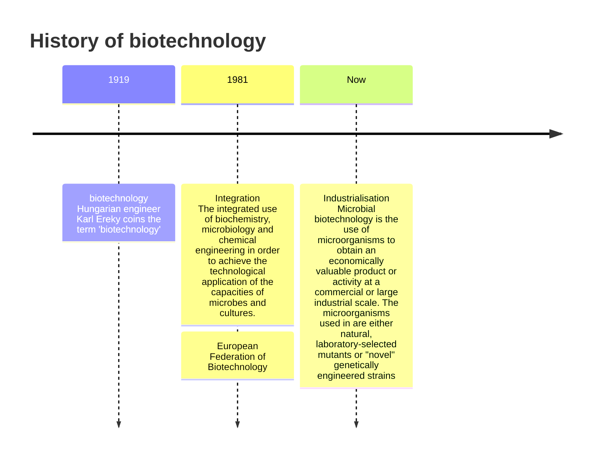

#### The Development Of Biotechnology

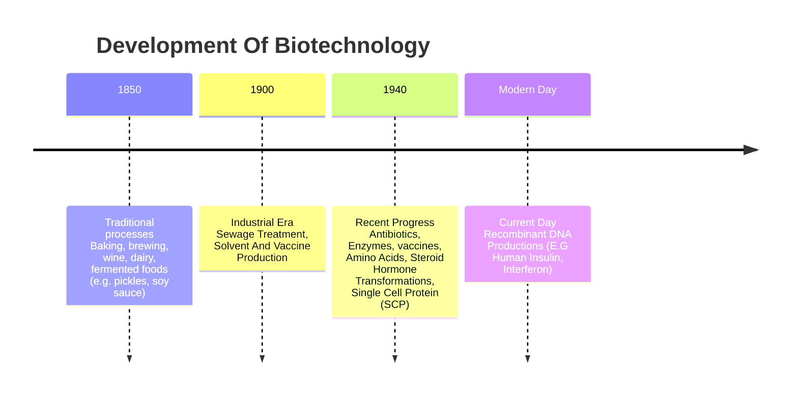


### Types Of Processes
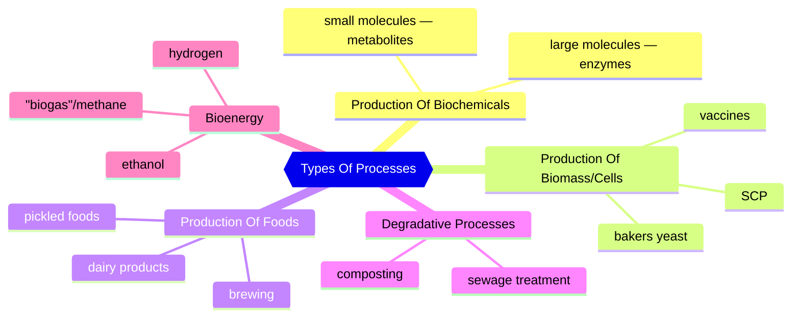

### Reasons Microorganisms Are Used In Biotechnology

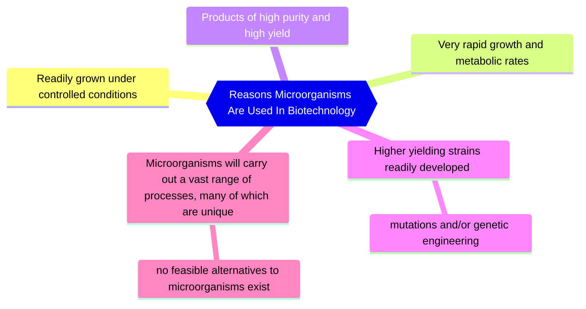


### Nutritional and cultural requirements for the growth of microorganisms


**Product:** commercially valuable resultant
Product Examples: amino acids to improve food taste, quality or preservation, enzymes, vitamins or pigments, hydrogen
**Essential Reactant:** the key factor to the process (The microbe)

### Basic principles of industrial processes


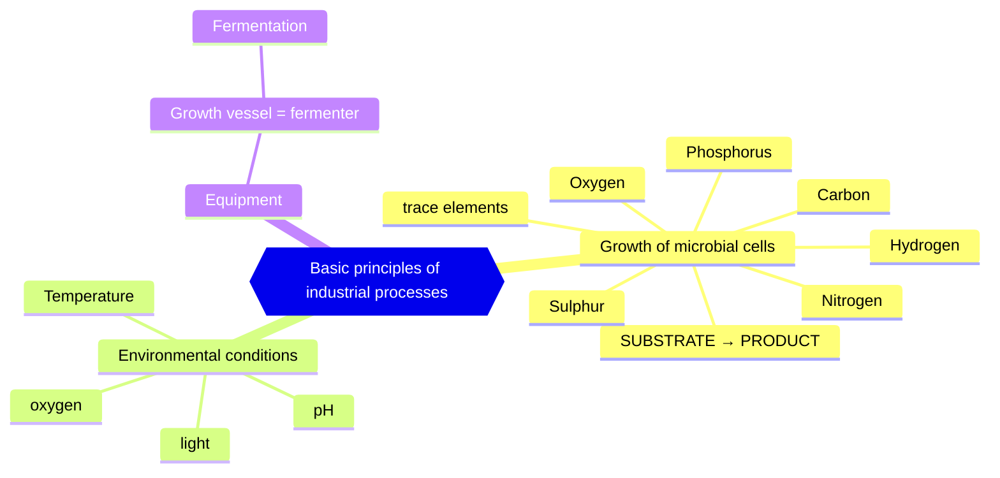


### Fermenter & associated process
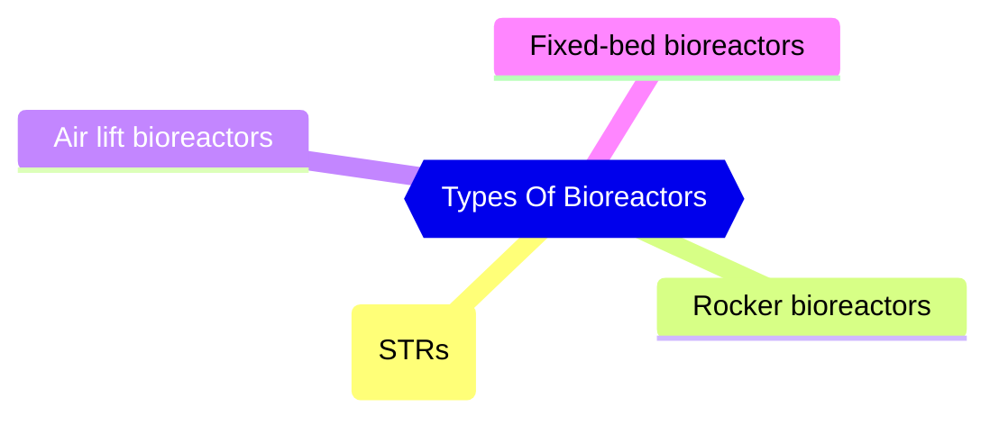


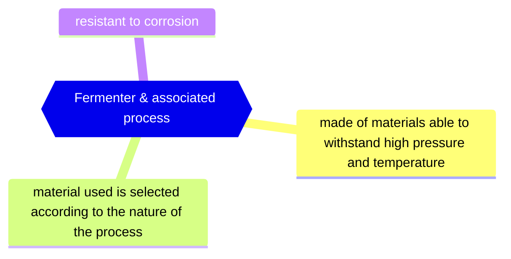


#### Sterilisation
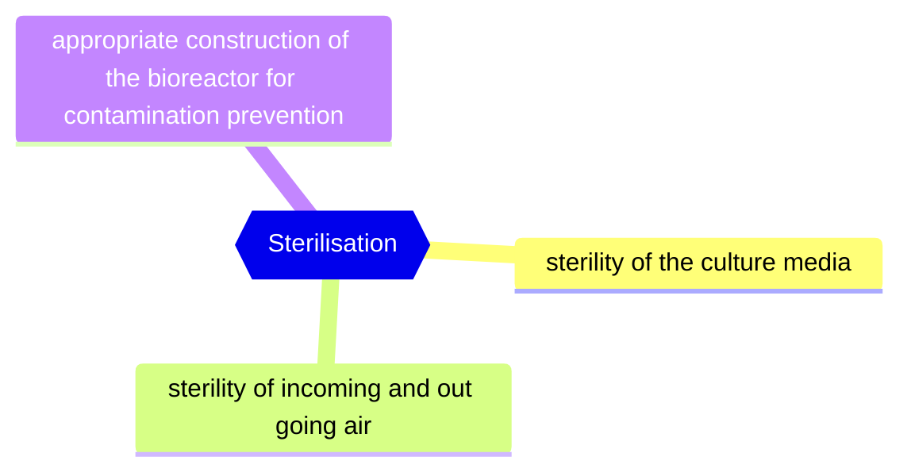


#### Common measurements and control systems in fermenters
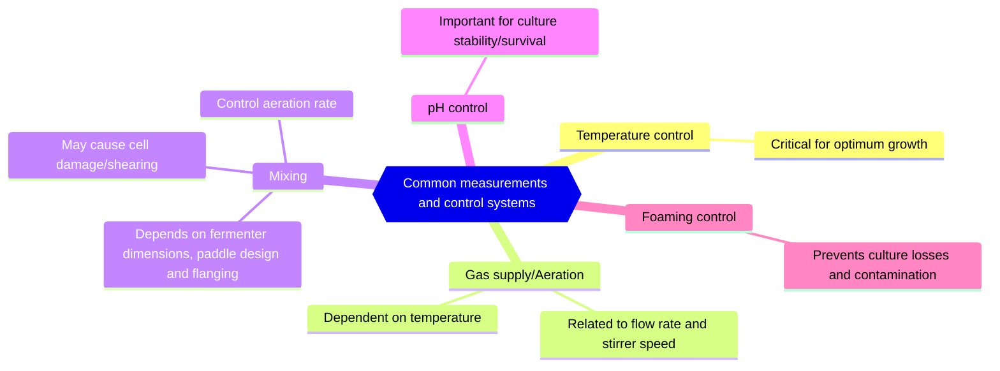
Important to keep factors constant during the process using a suitable control system (Like sensors/ biosensors)
[[Uni/3/6AB023 Microbial Biotechnology/Microbial Biotechnology#Temperature control\|#Temperature control]]
[[Uni/3/6AB023 Microbial Biotechnology/Microbial Biotechnology#pH control\|#pH control]]
#### Agitation
Agitation is performed in order to mix all three phases into a homogenous condition:
- **liquid** ( in the form of dissolved nutrients and metabolites)
- **solid** (in the form of cells and any solid substrates)
- **gas** (in the form of oxygen and carbon dioxide)

This promotes nutrient, gas and heat transfer.
Especially Important for oxygen transfer into liquid from the gas phase

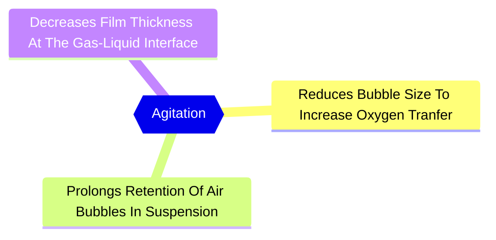


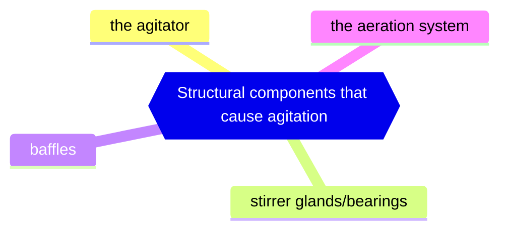


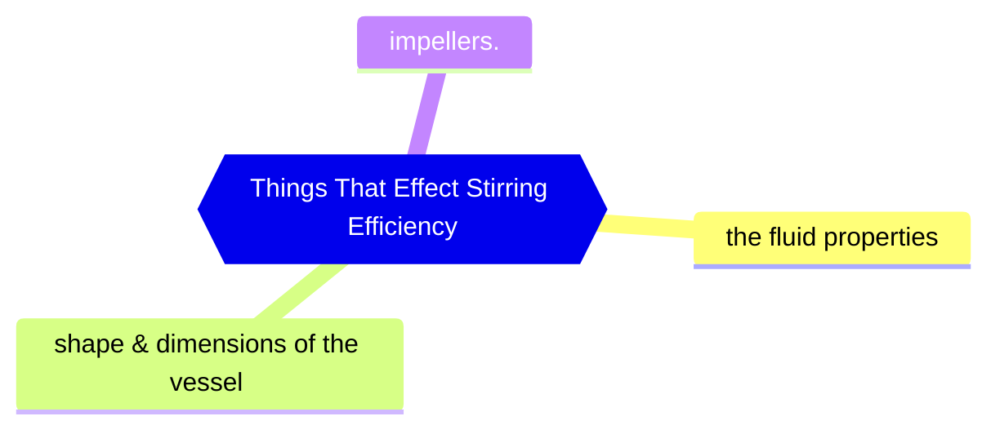

#### Basic functions of a fermenter
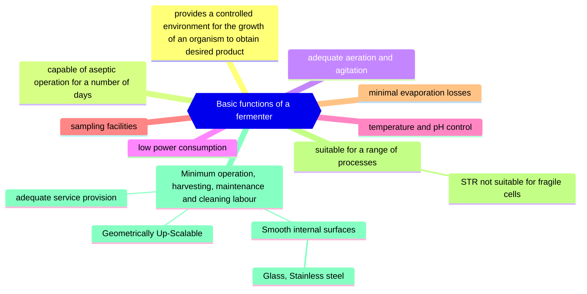


#### Chemical engineering process
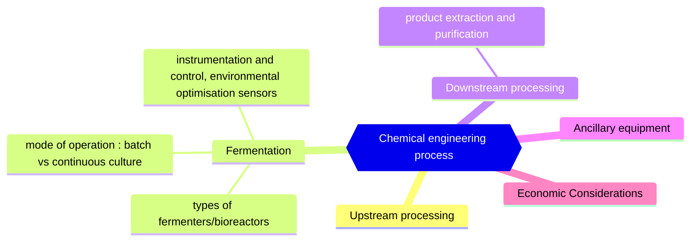


#### A schematic representation of typical fermentation process


#### Associated equipment
- **Bacterial cells** are generally robust and readily grow; many possible systems
- **Plant/animal cells** are fragile, less adaptable, slow growth; modify systems to suit
- **Photosynthetic cells** uniquely require light

#### Fermentation Processes
##### Batch Fermentation
Batch fermentation is a "closed system", all nutrients necessary for cell growth and product production are present in the medium from start and is finished when (mostly carbon sourced) nutrients have been used by the biomass

Only a limited amount of the carbon source can be used which limits generation of the product.


##### Fed Batch Fermentation


DOT: dissolved oxygen tension

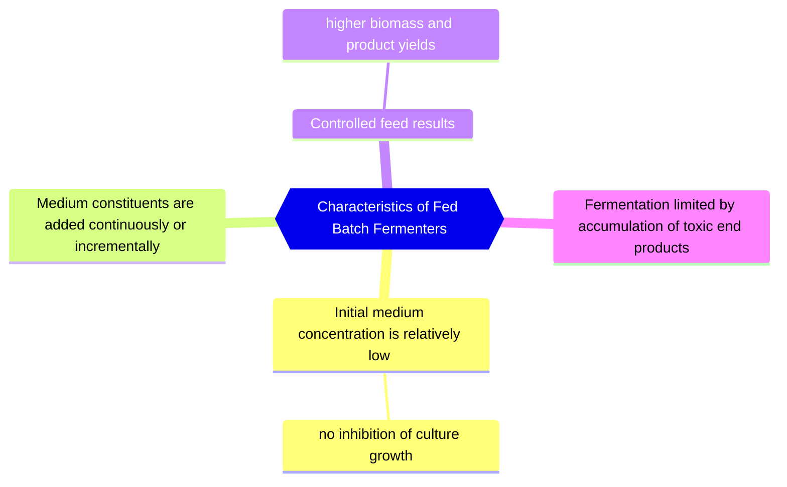


Medium Constituents: Concentrated Carbon And/Or Nitrogen


##### Continuous Fermentation
- Input rate = output rate (volume = const.)


- Product is harvested from the outflow stream
- Stable chemostat cultures can operate continuously for weeks or months.

#### Fermenter design
the design of a fermenter to carry out a fermentation in an efficient and predetermined manner is the most important objective function of fermentation engineering

##### Stirred tank reactor (STR) or Stirred tank fermenter (STF)
STR has mechanically moving impellers within baffled cylindrical vessel Whereas The STF Has No Moving Internals


A schematic of a continuous flow stirred tank reactor

###### Production of mycophenolic acid by Penicillium brevicompactum immobilized in a rotating fibrous-bed bioreactor (RFB)
Fungal morphology observed in free-cell stirred-tank (STF) and immobilized-cell rotating fibrous-bed (RFB) fermentations:


| STF (A):<br>                                                                                  | RFB (B):<br>                                                                                          |
| --------------------------------------------------------------------------------------------- | ----------------------------------------------------------------------------------------------------- |
| - fungal mycelia grew everywhere<br>                                                          | - all fungal mycelia were attached to the rotating fibrous matrix, forming a homogeneous biofilm,<br> |
| - large clumps of biomass was attached to the agitation shaft, pH and DO probes, reactor wall | - fermentation broth was clear.                                                                       |


##### Z®RP bioreactor
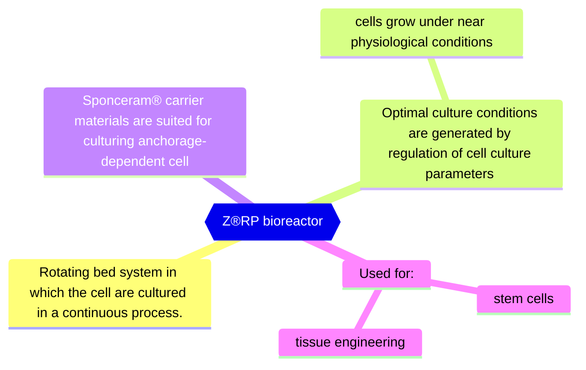


Small Fermenters Produce Less Waste

###### Z®RP Implant Blanks

A - SEM capture of chondrocytes in ECM, long-term culture on Sponceram® HA surface (5000-times magnification)- skin-like tissue
B- Cartilage layer, grown in vitro on Sponceram® HA cell carrier (courtesy of TU Hamburg-Harburg) - bone-like

Blanks Support Growth In The Shape You Need

##### Airlift fermenters
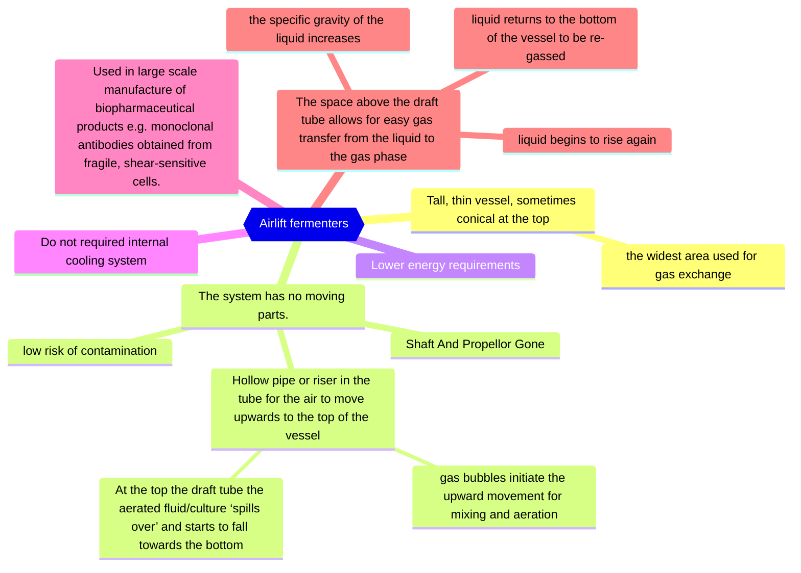


a) draft-tube configuration, b) a split cylinder device, c) an external loop system

##### Photobioreactors

###### Scale-up of Oldenlandia affinis cultures in air-lift photobioreactors
- Plants are source of a large number of useful pharmaceuticals.
- Cyclotides are di-sulfide rich mini-proteins with broad range of biological activity such as anti-HIV, cytotoxic and antimicrobial.
- The major problems hindering the development of large-scale cultivation of plant cells include:
	- low productivity, cell line instability
- Shake flask cultures are used, but industrial fermentation of natural products requires highly reproducible conditions.
- Need for scale-up and fermenter.

###### Photobioreactors for cyclotide production
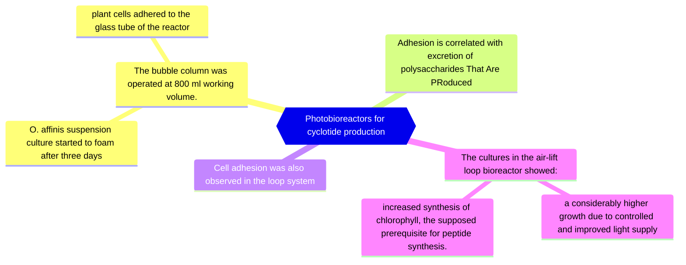

### Environmental monitoring and control
- The success of fermentation depends upon the existence of defined environmental conditions for biomass production and product formation.
- We need to know how to obtain optimal operating conditions.
- [[Uni/3/6AB023 Microbial Biotechnology/Microbial Biotechnology#Common measurements and control systems in fermenters\|#Common measurements and control systems in fermenters]]

#### SENSORS

```mermaid
mindmap
{{Types Of Sensors}}
	Physical sensors
		thermistor
		gas flow meter
		tachometer
		foam sensor
	Chemical sensors
		pH meter
		Disolved Oxygen electrode
		CO2 analyser
		oxygen analyser
		NAD analyser
		Biosensors — Type of chemical sensor.
```

##### Biosensor
Measuring device which employs biologically active material (that it is made of) which provides specific recognition of the target analyte, to a physical or chemical transducer, which generates electrical signal directed to a digital reader/control system.


```mermaid
mindmap
{{Bioactive components}}
	Enzymes
	Monoclonal antibodies
	Cells
		microorganisms
		tissues
	Nucleic acids
```


Advantages:
- high selectivity
- high specificity
- relative low cost
	- reduce assay time
	- can increase product safety
- small size
- on-line control of the fermentation process

Restrictions:
- optimal pH
- optimal temperature


#### Biosensor in monitoring and control


```mermaid
flowchart TB
    A(["Analyte"])
    B["Bioreceptor"]
    C["Bio-Recognition"]
    D["Transducer converts on type of energy to another"]
    E(["Signal processing, display, comparison to calibrations"])
    D --> E
    C --> D
    B --> C
    A --> B
    click B "[[#SENSORS]]"
    click D "[[#Transducer]]"
```


#### Immobilised enzyme biosensor

- Porous polycarbonate layer
	- limits the diffusion of the substrate into the second Immobilised Enzyme Layer
		- preventing the reaction becoming enzyme-limited
- The third layer, cellulose acetate, permits only small molecules, such as hydrogen peroxide, to reach the electrode
- The substrate is oxidised, in the enzyme layer, producing hydrogen peroxide, oxidised on platinum electrode
- The resulting current is proportional to the concentration of the substrate

#### Penicillin biosensor


### Transducer
A physical element which converts the stimulus generated by the bioactive layer to an electrical signal.

```mermaid
mindmap
{{Transducer}}
	Can Be:
		Electrochemical
			amperometric
			potentiometric
		Optical
		Mechanical
		Thermal
	May detect:
		a redox reaction
		light emission
		changed levels of ions
		luminescent/fluorescent signal
		a change in mass associated with surface
```
##### Linearity
###### In-line
- an integrated part of the fermentation equipment, obtained data are used directly for process control

###### On-line
- an integrated part of the fermentation equipment, direct measurement of fermentation parameters, the measured value cannot be used directly for control, an operator required for entering the data into the control system e.g. gas analyser
###### Off-line
- not part of the fermenter, requires sampling, the measured value cannot be used directly for control, operator needed for measurement and entering the data into the control panel
	- e.g. sample for spectrophotometric analysis

Real-time → instant, as it happens
### Computer Usage In Fermentation
```mermaid
mindmap
{{Computer Usage In Fermentation}}
	Process control
		timed series of operations
			sterilisation
			medium addition
			inoculation
	Data logging 
		printer
		data store
		graphics
	Alarms
	Environmental control 
		pH
		temperature
		Gas Availability
	Dynamic optimisation
		instant response to the sensed environment to maintain environmental and physiological conditions
	maximise culture productivity
	Modelling of fermentations
```

#### Temperature control
```mermaid
mindmap
{{Temperature control}}
	Heat supplied by direct heating probes or by heat exchange
	Microbial growth is very sensitive to temperature changes accurate temperature feed-back control is required
	Fermentations are exothermic - cooling may be required
```

#### pH control
```mermaid
mindmap
{{pH control}}
	Most cultures have narrow pH growth ranges
	The buffering in culture media is generally low
	Most cultures cause the pH of the medium to rise during fermentation
	pH is controlled by using a pH probe, linked via computer to NaOH and HCl input pumps.
```


### Foaming

 Foaming is caused when:
- microbial cultures excrete high levels of proteins and/or emulsifiers
- high aeration rates are used

Excess foaming causes loss of culture volume and may result in culture contamination

Foaming is controlled by use of a foam-breaker and/or the addition of anti-foaming agents (silicon-based reagents)

#### SPINNING CONES AS FOAM CONTROLLERS

## Week 2 Biodegradable Polymers.  

### Terminology

##### Polymer
are large molecules (macromolecules)  composed of many repeated sub-units (monomers)  

##### homopolymer
Only one subunit 
E.G -A-A-A-A-A-  

##### heteropolymer (co-polymer) 
Multiple subuinits 
E.G -A-B-B-A-C-  

##### Biopolymer 
polymer made from natural resources E.G Starch

##### Bioplastic
large family of different materials (either biobased, biodegradable or both)  
if biodegradable, it must be degraded completely, to only  natural biogenic compounds such as water, CO2, biomass  

##### Biobased
material derived from biomass - renewable resources, not from fossil oil  

##### Biodegradable
able to decay naturally and in a way that is not harmful
Biodegradability depends on the chemical structure of the material 

### Polymeric Materials
Classification by susceptibility to microorganism/enzymatic attack:  

#### Non-biodegradable  
(polyethylene – PE, polypropylene – PP,  polystyrene – PS)  

#### Biodegradable  
(polylactide – PLA, regenerated cellulose, starch, bacterial polymers)

### Polymers and plastics  
Plastics are materials formulated and prepared for use  
The main components of plastics are the polymers with additives  


### Biopolymers & Microbes

#### Which biopolymers should be produced ?
- Currently only a few biopolymers can compete with their petrochemical equivalents  
	- based on price & performance  
- Bacterial cellulose (BC), Poly-glutamic acid (PgGA) Poly-hydroxyalkanoates (PHA) and Poly-lactic acid (PLA) are good examples of biopolymers that could capture a substantial part of the bioplastic market  
#### What is poly-γ-glutamic  
- Polymer of glutamic acid residues.  
	- unusual anionic polypeptide in which D and/or L-glutamate is polymerized via γ-amide linkages  
- Non-toxic, non-immunogenic and edible  

Anthrax Capsule Made From Glutamic Acid
##### Applications of γ-PGA
```mermaid
mindmap
{{Applications of γ-PGA}}
	FOOD  
		Cryoprotectant  
		Bitterness relieving agent
		Thickener  
		Humectant  
		Properties of wheat dough  
	MEDICAL  
		Drug delivery  
		Nanoparticles  
		Biological adhesive  
		Biodegradable scaffold  
		Anti-mutagenic agent  
	OTHER  
		Waste water treatment  
		Cosmetics  
		Diapers 
```


### Analysis  

Salt/Acid form of γ-PGA (ICP)  
Yield (g/l)  
Crystallinity (XRD)  
Identification (FTIR, NMR)  
Molecular weight (GPC)

#### Yield


#### XRD


#### Molecular weight  

#### Medium E

#### Medium GS


#### Hemolytic activity
 

#### Lecithinase activity


#### PCR of genes encoding toxins


#### Probiotics  
Live microorganisms that when administered in adequate amounts confer a health benefit on the host

#### Maintaining viability of ‘friendly’ bacteria
Freeze drying 
Storage 
Ingestion  

#### Viability of B. breve in simulated gastric juice (Free cells and polymer protected cells)  


### Cancer therapies  

Use of oncolytic adenovirus coated with γ- PGA for effective and safe cancer therapy.
Smart Adenovirus Nano complexes as a Therapeutic Vehicle


#### Oncolytic Ad  
- preferentially infects and kills cancer cells 

##### Limitations
- Immune response  
- High liver tropism  
- Lack of tumour tropism upon systemic delivery  


##### Modification of Ad is needed to:  
- increase retention time in the blood  
	- More Likely To Encounter Cells
- avoid accumulation in the liver

###### Ionic-gelation Method  
Encapsulation efficiency 93%  

###### HEK 293 cells
(Proof That The Particle Can Get Into The Cell)
- Visible clear attachment and/or internalisation of NPs  
- PGA can boost cellular uptake possibly through a specific receptor-mediated pathwayFITC-labelled γ-PGA-chitosan NPs  


###### Sustainability
Needs To Be Cheap To Become Commercial/Viable
### Xerostomia, acidic drinks and bacterial  PGA  
- Salivary phosphoproteins protect the enamel from acid dissolution and acting as a reservoir for free calcium ions  
- A reduction in salivary flow leads to a prolonged dry mouth, known as xerostomia  
- Xerostomia include severe dental hard tissue destruction, leading to a clinical condition termed “rampant dental caries”  
The biochemical and physical properties of ɣ-PGA suggest its suitability as an anti-cariogenic agent, and a therapeutic treatment for rampant caries associated with xerostomia

#### Protection of tooth enamel project  
Microbial polymer of γ-PGA tested showed an excellent inhibitory effect on the dissolution rate of  
calcium ions form teeth enamel  
Is The Calcium In The Acid Solution (From The Teeth)

#### Brown Algae as a Valuable Substrate for the Cost- Effective γPGA for Applications in Cream Formulations  
- Successful incorporation of seaweed-derived γ-PGA (0.2–2 w/v%) was achieved for several model cream systems with absorbances reported at 300 and 400 nm.  
-  Seaweed-derived γ-PGA cream systems did not display any negative effect on model HaCaT keratinocytes by means of in vitro MTT  

#### Can γ-PGA help fight Parkinson’s ?  
- γ-PGA has previously demonstrated anti inflammatory/antioxidative properties and has shown to alleviate neuronal cell death  
- Can γ-PGA reverse cytotoxic effect and cellular inflammation?  
- Can γ-PGA be explored as a potential therapeutic molecule in the context of α-synuclein pathology?

#### Can microbes help fight Parkinson’s ?  
- Parkinson’s disease (PD) affects around ten million people worldwide  
- PD is the second most widespread neurodegenerative disease after  
- PD pathology is characterized by a loss of dopaminergic neurons and the development of lewy bodies - proteins, mainly α-synuclein.
- α-synuclein during stress or degeneration can be released into extracellular environment and can be taken up by neurons and astrocytes  
- astrocytes normally are involved in clearance of α-synuclein, therefore protect neurones, however their capacity is limited  
- extensive uptake leads to cellular toxicity and inflammation and astrocytes loose protective role

#### γ-PGA as a chelator of protein accumulation  
Alzheimer's disease, Parkinson's diseases, amyotrophic lateral sclerosis, dementia with Lewy bodies, frontotemporal dementia, Huntington's disease, amyloid transthyretin cardiomyopathy are all Protein aggregation diseases  

#### γ-PGA limits the extent of α-synuclein PFFs in primary astrocytes  
γ-PGA has a marked inhibitory effect on astrocyte ability to internalize α- synuclein PFFs, leading to reduced cellular toxicity  

#### Problems with synthetic plastics  
- Plastics litter oceans and the coastlines  
- Plastics use valuable/limited oil resources  
- Some plastics leach small amounts of pollutants, that are toxic to life  
- PE the most manufactured pertochemical polymer (29% of global production)  
- Only 10% recycled !  

#### Microbial bioplastic  
- Are produced bacteria as a carbon and energy storage material  
- Synthesized as intracellular granules  
- Accumulated as a result of nutrient limitation in the presence of excess supply of carbon source 

#### Microbial polyhydroxyalkanoates (PHA)
- Are produced by bacteria as a carbon and energy storage material  
- Synthesized as intracellular granules  
- Accumulated as a result of nutrient limitation in the presence of excess supply of carbon source 

#### Polyhydroxyalkanoates (PHAs)  
- Are produced bacteria as a carbon and energy storage material  
- Synthesized as intracellular granules  
- Accumulated as a result of nutrient limitation in the presence of excess supply of carbon source 


#### Bacterial PHB  
- Homopolimer -A-A-A-A-A-  
- White crystalline powder with isotactic structure  
- High molecular weight and melting point (~180 oC)  
- Biodegradable and non-toxic  
- BUT rather brittle  


Copolymers -A-A-A-B-B-A-C-  
- different monomers, almost always 3-hydroxy fatty acids  
- BUT may also contain 4-, 5- and 6- hydroxy fatty acids or monomers with aromatic rings  

- Mixed carbon sources needed

##### Biomaterial properties

| Parameter                  | PHB | PHBV | PHBHx | PP    |
| -------------------------- | --- | ---- | ----- | ----- |
| Melting temperature (°C)   | 177 | 145  | 127   | 176   |
| Glass transition temp (°C) | 2   | -1   | -1    | -10   |
| Crystallinity (%)          | 60  | 56   | 34    | 50-70 |
| Tensile strength (MPa)     | 43  | 20   | 21    | 38    |
| Extension to break (%)     | 5   | 50   | 400   | 400   |

##### Where are applied 
```mermaid
mindmap
{{Common Biomaterial Uses}}
	AGRICULTURE  
		mulch films  
	MEDICAL
		biodegradable scaffolds  
		controlled antibiotic release systems 
		implants
		sutures  
		heart valves  
		bone graft substitutes  
	OTHER  
		Packaging  
		Coatings  
		Car industry  
		Textiles
```


#### Bacterial bioplastics from waste cooking oil  
Waste cooking oil → Bacteria with PHA → granules Bioplastics!  
‘Work by a research team at the University of Wolverhampton suggests that using  
waste cooking oil as a starting material for the production of bioplastic can  
reduce production costs significantly…’  

#### Electrospun Fibres of Polyhydroxybutyrate Synthesized by Ralstonia eutropha from Different Carbon Sources  


#### PHA as biomaterials  
- biomedical/pharmaceutical areas have been approved by FDA in 2007  
- PHAs are biodegradable, biocompatible, they are used to produce microspheres, microcapsules, and nanoparticles, films and porous matrices  
- their degradation products are non toxic  
- drug release from the polymeric material occurs through osmosis, diffusion or biodegradation mechanism  
	- release depends on composition of the composition of PHA

#### 3D printed PLA/PHA filaments  
Vertical specimens have improved mechanical properties compared to horizontal specimens,  
MTT assay with HEK293 shows the horizontally printed specimen tended to produce more growth from day 4 onwards.  

#### PHA applications  
- Regenerative medicine  
- Bio-implants  
- 3D printing material  
- Surgical stitching and coronary stents  
- Time release capsules  


#### Bacterial Cellulose 
- Bacterial cellulose (BC) is a natural biopolymer synthesized in abundance by different strains of bacteria  
- Consist only glucose monomer  
- BC unique properties:  
- Biocompatibility  
- Can be mouldable into 3D structures  
- Chemically pure  
- Ultra fine network
- Bacterial cellulose (BC) is a natural biopolymer synthesized in abundance by different strains of bacteria  
- Acetobacter sp, Rhizobium sp.  
- Consist only glucose monomer  
- BC unique properties:  
- Biocompatibility  
- Mouldable into 3D structures  
- Chemically pure  
- Ultra fine network


##### Why it is produced  

Virulence

##### Where has it been applied?  


## Week 3 MONOCLONAL ANTIBODIES  

Antibodies  
• Also known as immunoglobulins  
• Y-shaped: 2 heavy and 2 light  
chains are polypeptides  
• Chains are held together by  
disulphide bridges  
• Each Ab has 2 identical Ag  
binding sites – variable  
regions.  
• The variable region of the  
heavy and light chain  
determine what antigen the  
antibody recognizes and  
binds to.  
https://blog.addgene.org/antibodies-101-introduction-to-antibodies

Antibody Structure  
• Antibodies have two regions:  
Fab, or antigen-binding region  
Fc, or crystallizable region.  
• 2 identical immunoglobulin (Ig) heavy chains  
and 2 Ig light chains make up each antibody  
molecule.  
• The Fc region and part of the Fab regions are  
made from the Ig heavy chains, and the rest of  
the Fab regions are completed with the Ig  
light chains.  
• Each Light Chain Bound To Heavy Chain By  
Disulfide (S- S)  
• Heavy Chain Bound to Heavy Chain (S-S)  
https://blog.addgene.org/antibodies-101-introduction-to-antibodies

Structure of Immunoglobulins/Antibodies  
Image: http://immunesystemimmunity.blogspot.com/2012/02/basic-structure-of-antibodiesimmune.html

How Abs work  
• Play a natural part of the immune system: produced by B  
cells.  
• They bind to proteins on the surface of extracellular  
pathogens such as parasites or microbes, or to proteins  
expressed on the surface of cells that have been infected with  
a microbe, to trigger immune cascades that clear these  
infections. Some work as antitoxins i.e. they block toxins e.g.  
those causing diphtheria and tetanus  
• Some attach to bacterial flagella making them less active and  
easier for phagocytes to engulf  
• Some cause agglutination (clumping together) of bacteria  
making them less likely to spread  
• Anything that generates an antibody response in the immune  
system is referred to as an antigen.

Antibody Classes  
© New Science Press Ltd. 2003  
• The constant region of the  
heavy chain determines the  
antibody’s isotype.  
• 5 broad groups of antibodies  
(IgM, IgD, IgA, IgG, or IgE).  
• Each isotype is expressed at  
different times of the immune  
response and initiates  
different immune cascades.  
• In the research setting,  
antibodies of different  
isotypes can be used together  
in the same experiment  
because the reagents used to  
detect the presence of an  
antibody depends partially on  
its isotype.

The Immunoglobulin Superfamily  
a few examples

G – General immunity (long-  
term, crosses placenta)  
A – At mucosal surfaces  
(secretions, breast milk)  
M – Main in primary response,  
complement activator  
E – Allergy & parasite defence  
D – Development of B cells

Antibody functions  
IgG  
• Most abundant in blood and extracellular fluid (~70–80% of total antibodies).  
• Provides long-term immunity after infection or vaccination.  
• Can cross the placenta, giving newborns passive immunity.  
• Activates complement system and promotes opsonization (enhanced phagocytosis).  
• Important in secondary (memory) immune response.  
IgA  
• Found mainly in mucosal surfaces (respiratory tract, GI tract, urogenital tract),  
as well as in saliva, tears, breast milk.  
• Provides mucosal immunity by preventing pathogens from adhering to  
epithelial cells.  
• Exists in dimeric form (secretory IgA) in secretions, resistant to enzymatic  
digestion.  
• Provides passive immunity to infants through breast milk.

IgM  
• First antibody produced during primary immune response.  
• Largest antibody (pentamer form).  
• Excellent at activating complement.  
• Provides early defense before sufficient IgG is produced.  
• Found in blood and lymph.  
IgE  
• Involved in allergic reactions (binds to allergens and triggers mast cell and  
basophil degranulation → histamine release).  
• Plays a role in defense against parasitic infections (e.g., helminths).  
• Normally present in very low concentrations in blood.  
IgD  
• Found in small amounts in blood and on the surface of immature B cells.  
• Functions as a B cell receptor (BCR), helping in activation of B cells.  
• Least understood; not abundant.

Production of Antibodies  
• B lymphocytes (known as B-  
cells): produced in the bone  
marrow.  
• Responsible for humoral  
immunity, or the production of  
antibodies.  
• B-cells are produced in the bone  
marrow and then travel to the  
spleen and other lymphatic  
organs to mature.  
• Once matured, B lymphocytes  
become activated when there is  
a pathogen with antigens they  
have a match to.  
Figure 2: This diagram shows a B lymphocyte  
(white blood cell) releasing antibodies. There are  
also antibodies bound to the surface of the B  
lymphocyte.

B -Lymphocytes  
B-cell mature: plasma cells  
Plasma cells are antibody factories and produce  
mass quantities of their particular antibody to  
help attack the pathogen.  
Plasma cells are one subtype of B lymphocytes.  
The other B lymphocyte subtype is memory  
cells.  
Memory cells are stored cells that 'remember' a  
pathogen through antibody production. When  
the body encounters a pathogen again, these  
memory cells are quickly activated and form  
more plasma cells, thus increasing the speed of  
the immune response.  
This is how immunity works from both natural  
infections and vaccines.

Polyclonal Vs Monoclonal Antibodies  
Polyclonal Monoclonal

• A heterogeneous mixture of many antibodies that recognize the same protein.  
• In the immune system, antibodies are produced by B cells. Each individual B  
cell produces antibodies that all recognize the same epitope, of the target  
protein. These antibodies are also all the same isotype.  
• All the B cell clones in the immune system make different isotypes of antibodies  
that recognize many different epitopes of the target protein.  
• Production of monoclonal antibodies starts with selecting just one of these B  
cell clones for further antibody production, polyclonal antibodies include any  
antibodies produced during the immune response.  
Polyclonal Antibodies

Polyclonal antibodies are generated by injecting an  
animal with an immunogen, then isolating and purifying  
the antibodies produced from its serum several weeks https://blog.addgene.org/

• A homogenous population of antibodies that all recognize the same  
epitope of the target protein.  
• “Monoclonal” refers to antibodies that are all of the same isotype  
and specificity as they derive from a single B cell clone.  
• Most commonly these antibodies are produced from a hybridoma  
(a fusion between an antibody-producing B cell and a myeloma  
cell).  
Monoclonal Antibodies

https://blog.addgene.org/  
Hybridoma Technology  
• Hybridomas are formed by fusing B cells that have been extracted from animals injected with protein  
antigen to myeloma cells.  
• The hybridomas are then subcloned by limiting dilution, which produces an immortalized, clonal  
population of cells that produce a single variant of antibody.  
HAT media in order to  
differentiate hybridoma cells  
from unfused myeloma and  
spleen cells.  
Hypoxathine, Aminopterin,  
Thymidine (HAT), a step  
which kills any unfused  
myeloma cells that might  
outgrow the other weaker  
hybridoma cells. Unfused B  
cells have limited powers of  
division and will die off  
naturally in culture.

Hybridoma Technology-Process

• Antibodies have important uses beyond  
fighting infections in the body.  
• Production of long-lasting monoclonal  
antibodies is a recent invention, and it is used  
in both medicine and research.  
• Monoclonal Antibody: a stable  
antibody which can be used over a  
period of time  
Monoclonal Antibodies

Monoclonal Antibody Nomenclature  
(WHO guidelines)  
Tras-tu-zu-mab  
prefix sub-stema sub-stemb general stem  
General stem: mab (monoclonal antibody)  
Sub-stem a : sub stem for disease or target group e.g  
ci: cardiovascular tu: tumour  
Sub-stem b: for source of product e.g  
Human: u; Rat:a chimeras: xi  
Humanized: zu  
prefix: random names  
Therefore Trastuzumab is a humanised  
monoclonal antibody used to treat

2018 Nobel Prize in Chemistry (self-study)  
• Awarded to three scientists for their discoveries in enzyme research  
(Americans Frances Arnold and George P Smith shared the prize  
with Briton Gregory Winter from Cambridge University)  
• The scientists developed a technique called phage display to  
synthesise new proteins such as antibodies.  
• They used bacteriophages, viruses that infect bacteria, to generate new  
antibodies  
• The first antibody based on this method, adalimumab, was approved in  
2002 and is used to treat rheumatoid arthritis, psoriasis and  
inflammatory bowel diseases.  
• Phage display technology is used to produce antibodies that can  
neutralise toxins, counteract autoimmune diseases and treat metastatic  
cancer.  
Ref:https://www.bbc.co.uk/news/science-environment-45655152  
Recombinant mAbs

Phage display and selection: A  
bacteriophage highlighting the  
genotype-phenotype coupling  
that is fundamental to phage  
display technology.  
Phage Display Technology-Principle  
A biotechnology technique that uses bacteriophages (viruses that infect bacteria) to display  
peptides or proteins on their outer surfaces, linking their genetic code (genotype) to the  
displayed protein (phenotype).  
https://cdn1.sinobiological.com/styles/default/images/pdyimg/CRO/resources/u13.png

Step 1: Construction of Phage  
Display Libraries  
Using recombinant DNA technology,  
foreign cDNA is integrated into the  
viral DNA of bacteriophages. Each  
phage in the library displays a unique  
protein, peptide, or antibody on its  
surface.  
Step 2: Target Binding  
Once the phage display library is  
constructed, it is exposed to a target  
molecule. This target could be an  
immobilized protein, a cell surface  
receptor, or any other molecule of  
interest. Only phages with proteins that  
have a high affinity for the target will  
bind, while others remain unbound.  
Step 3: Washing Away Non-Specific  
Phages  
The mixture is washed to remove any  
phages that do not specifically interact  
with the target ensuring that only the  
phages with the desired binding  
properties remain.  
Step 4: Elution of Bound Phages  
The phages that have successfully bound to the target are then eluted from  
the target.  
Step 5: Amplification and Enrichment  
The eluted phages are amplified by infecting a new host cell E. coli cells,  
allowing them to replicate. This cycle is repeated several times to enrich  
the library for the best binders. The final step involves purifying the phage  
repertoire to increase the phage titer, ensuring a highly concentrated  
collection of the best-binding phages.  
https://www.biointron.com/

Example of mABs produced by  
Phage Display Technology  
• Adalimumab (trade name: Humira): An anti-TNF drug.  
• Treatment of rheumatoid arthritis and Crohn’s disease  
• In rheumatoid arthritis TNF (tumour necrosis factor) is  
produced which causes  
– inflammation,  
– pain and  
– damage to the bones and joints.  
• Anti-TNF drugs such as adalimumab block the action of TNF  
and reduce inflammation.  
• Video:Mechanism of action of Adalimumab (Humira)

https://www.tandfonline.com/doi/full/10.1080/17460441.2024.2367023#d1e156

phage display vs hybridoma  
Phage display Hybridoma  
Advantages  
• Large scale production  
• Fast process  
• Great control over the  
selection process  
• Easy to screen a large  
diversity of clones  
• Possible to directly screen  
human libraries  
• Possible to screen toxic  
antigens  
• No immunogenicity issue  
(for naïve libraries)  
• No clone viability issues  
• Direct access to sequence  
• No animal use (for naïve  
libraries)  
• Large scale production  
• High antibody yield  
• High specificity  
• High antibody  
sensitivity  
• Lower cost  
Disadvantages  
• More expensive  
• Binders may have lower  
affinity  
• Technically more difficult  
• Long generation time  
• Incomplete epitope  
identification  
• Often requires  
humanization

Large-Scale Production of Monoclonal  
Antibodies  
Commercial-scale production of mABs for three purposes:  
 Diagnosis  
 Therapy  
 Research  
Production :  
Small and Medium scale Production: culture flasks, roller bottles etc. are used  
Large scale Production: Deep-tank stirred fermenters, airlift reactors etc.

Polyclonal Vs Monoclonal Antibodies  
Polyclonal Antibodies Monoclonal Antibodies  
Produced by different clones of B cells Produced by single clone of B cells  
They are Ig secreted against a particular  
antigen , therefore interact with different  
epitopes of the same antigen  
Interact with a particular epitope on the  
antigen  
They are a heterogeneous mixture of  
antibodies  
They are a homogenous mixture of  
antibodies  
Produced by immunisation of animals Produced by hybridoma or phage  
display technology  
Inexpensive and relatively easy to  
produce (+/- 3 months)  
Production process is time consuming  
and expensive (+/- 6 months)  
High overall antibody affinity High specificity to a single epitope  
Batch to batch variability & High cross  
reactivity  
Batch-to-batch reproducibility and low  
cross reactivity  
Examples :ELISA, hemagglutination,  
snake antivenom  
Examples: Immunoassays, Herceptin

Monoclonal  
Antibody  
Applications

Monoclonal Antibody  
Applications  
• Diagnostic Tests  
– Abs are capable to detect tiny amounts (pg/mL) of  
molecules  
– Ex. Pregnancy hormones  
• Diagnostic Imaging  
– mAbs that recognize tumor antigens are radiolabeled  
with iodine I-131  
• Immunotoxins  
– mAbs conjugated with toxins  
• mAbs To Clear Pathogens  
– Anthim (Oblitoxaximab)-www.elusys.com  
– treatment of inhalational anthrax due to Bacillus anthracis

Monoclonal antibodies used in  
medicine  
Standardized, unlimited amounts of reagents for diagnosis or  
therapy (human antibodies or “humanized” antibodies can be  
made).

Pregnancy Tests  
• Pregnant women have the hormone human chorionic gonadotrophin (hCG) in  
their urine.  
• Monoclonal antibodies to hCG have been produced. These have been  
attached to enzymes which can later interact with a dye molecule and  
produce a colour change.

Pregnancy Tests

Diagnosis of HIV Infection  
• The test of HIV  
infection is based on  
detecting the  
presence of HIV  
antibody in the  
patient’s blood  
serum.  
HIV Virus

a) HIV antigen is attached to the plate.  
b) Patients serum passed over the plate. Any HIV  
antibody in the patients serum will be attached  
to the antigen already on the plate.  
c) A second antibody which is specific to the HIV  
antibody is passed over the plate. This antibody  
will attach to the concentrated HIV antibody  
on the plate. This second antibody has an  
enzyme attached to its structure.  
d) Chromagen dye is passed over the complex of  
concentrated HIV antibody/conjugated  
antibody.  
e) The enzyme will turn the chromagen to a more  
intense colour. The more intense the colour, the  
greater the HIV antibody level. This would be  
the a positive result for a HIV test.

Monoclonal antibodies  
Anticancer therapy

Treatment of Cancer  
• Cancer cells carry specific tumour-associated  
antigens (TAA) on their plasma membrane.  
• Monoclonal anti-TAA antibodies have been  
produced.  
• Drugs which kill tumour cells or inhibit key  
proteins in tumour cells are attached to  
monoclonal anti-TAA antibodies.  
• Cancer cells are specifically targeted, avoiding  
damage to healthy host cells.

What Diseases to Target and How?  
• Cancer cells express a variety of antigens that  
are attractive targets for monoclonal antibody-  
based therapy.  
• The development of monoclonal antibodies  
against specific targets has been largely  
accomplished by immunizing mice against  
human tumor cells and screening the  
hybridomas for antibodies of interest.

Other obstacles to the use of monoclonal  
antibodies in cancer treatment  
• Antigen distribution of malignant cells is  
highly heterogeneous, so some cells may  
express tumor antigens, while others do not.  
• Tumor blood flow is not always optimal  
• High interstitial pressure within the tumor can  
prevent the passive monoclonal antibody from  
binding.

Types of mAb designed  
Murine source mAbs  
• rodent mAbs with excellent affinities and specificities, generated using conventional  
hybridoma technology.  
• Clinical efficacy compromised by HAMA(human anti murine antibody) response,  
which lead to allergic or immune complex hypersensitivities.  
Chimeric mAbs  
• chimers combine the human constant regions with the intact rodent variable regions.  
• Affinity and specificity unchanged.  
• Also cause human anti-chimeric antibody response (30% murine resource)  
Humanized mAbs  
• contained only the CDRs of the rodent variable region grafted onto human variable  
region framework

Evolution of Therapeutic Antibodies

Common Chemotherapy in Treatment of Cancer  
Shortcomings of conventional chemotherapy:  
A. Lack of in vivo selectivity -The mechanism of anti-  
proliferation on cells cycle, rather than specific  
toxicity directed towards particular cancer cell  
B. Host toxicity: most have bad side-effects such as no  
appetites, vomiting , hair loss -treatment  
discontinued

Monoclonal antibodies for cancer treatment  
Mechanism of Action  
A. mAbs act directly when binding to a cancer specific antigens and  
induce immunological response to cancer cells. Such as inducing  
cancer cell apoptosis, inhibiting growth, or interfering with a key  
function.  
B. mAbs are modified for delivery of toxins(cytotoxic),  
radioisotopes, cytokines or other active conjugates.  
C. It is also possible to design bispecific antibodies that can bind  
with their Fab regions both to target antigen and to a conjugate or  
effector cell  
Ref:http://www.meds.com/immunotherapy/monoclonal_antibodies.html

mabs TREATMENT FOR CANCER CELLS  
ADEPT, antibody directed enzyme prodrug therapy; ADCC, antibody dependent cell-  
mediated cytotoxicity; CDC, complement dependent cytotoxicity; MAb, monoclonal  
antibody; scFv, single-chain Fv fragment.  
Carter P: Improving the efficacy of antibody-based cancer therapies. Nat Rev Cancer  
2001;1:118-129

‘Naked’ Monoclonal Antibodies  
• ‘Naked’ means these antibodies are not fused to a  
toxin.  
• Naked Monoclonal antibodies can kill cells via a  
variety of mechanisms, including: Antibody-  
Dependent Cellular Cytotoxicity (ADCC),  
Complement-Dependent Cytotoxicity (CDC), and  
direct induction of apoptosis.  
• However, the precise clinical mechanisms often  
remain uncertain

Rituximab (Rituxan)  
• Rituximab is a chimeric monoclonal antibody that  
targets the CD20 B-cell antigen.  
• This antigen is expressed on 90% of B-cell  
neoplasms  
• The precise biological functions of CD20 are uncertain,  
but the antibody is believed to function by flagging the  
B-cells for destruction by the body’s own immune  
system, including ADCC, CDC, and apoptosis.  
• This antibody thus leads to the elimination of all B-cells  
from the body (including cancerous ones), allowing  
new, healthy B-cells to be produced from lymphoid  
stem cells.

Trastuzumab (Herceptin)  
• Herceptin is an anti-cancer antibody that acts on HER2  
receptor, which is overexpressed in breast cancer. Only  
cells overexpressing this receptor are susceptible.  
• Such cells, when treated with Herceptin, undergo arrest  
in the G1 phase of the cell cycle and experience a  
reduction in proliferation.  
• This can reduce the rate of relapse of breast cancer by  
50% during the first year.  
• The precise mechanism of action is still under  
investigation.  
• VIDEO: http://www.youtube.com/watch?v=48VSU4  
AZ-L0

Bevacizumab  
(Avastin, Genentech/Roche)  
• Bevacizumab is an angiogenesis inhibitor a drug that slows  
the growth of new blood vessels by inhibiting vascular  
endothelial growth factor A (VEGF-A).  
• It is licensed to treat colorectal, lung, breast , kidney and  
ovarian cancers.  
• VEGF-A is a chemical signal that stimulates angiogenesis in  
a variety of diseases, especially in cancer.  
• Bevacizumab is a humanized monoclonal antibody  
YouTube video: https://www.youtube.com/watch?v=3xmlYr1AGx8.

Gemtuzumab ozogamicin (Mylotarg)  
• This monoclonal antibody is conjugated to the  
cytotoxic agent calicheamycin  
• It is used to treat acute myelogenous leukemia  
(AML), which is a cancer of the myeloid line of  
blood cells.  
• This monoclonal antibody attacks the CD33  
receptor, which is found in most leukemic blast cells,  
but not in normal hematopoietic stem cells

Gemtuzumab ozogamicin (Mylotarg)  
• Once bound to CD33, the antibody-calicheamycin  
complex is transported inside of the AML cells by  
lysosomes.  
• To facilitate selective release inside of the cancer  
cells, calicheamycin is connected to gemtuzumab by  
a chemical linker that is stable at physiologic pH but  
is hydrolyzed in the acidic pH of the lysosomes that  
transport the antibody-calicheamycin complex into  
the cell.

Global Market of mAbs  
REPORT HIGHLIGHTS  
• Sales of monoclonal antibody products have grown from  
approximately $50 billion in 2010 to almost $91 billion in  
2017.  
• World-wide sales of monoclonal antibody products to be  
approximately $110 billion by 2018 and nearly $132 billion by  
2018.  
• Increasing R&D to the development of therapeutic mAbs  
• Supportive government initiatives  
• UK cost of treating 1 patient with Herceptin for 1 year:  
£21,800 in 2016!  
• Herceptin injection 1 vial of 100 mg: £1641.20 (NHS  
indicative price, 2018).

References  
• Ratledge, C., & Kristiansen, B. (2014). Basic biotechnology(3rd ed.). Cambridge, England:  
Cambridge University Press.  
• Therapeutic antibodies for human diseases at the dawn of the twenty-first century. Brekke OH1,  
Sandlie I. Nat Rev Drug Discov. 2003 Jan;2(1):52- 62.  
• Ascoli CA, Aggeler B (2018) Overlooked benefits of using polyclonal antibodies. BioTechniques  
65:127–136. https://doi.org/10.2144/btn-2018-0065  
• Fishman JB, Berg EA (2019) Antibody Purification and Storage. Cold Spring Harb Protoc  
2019:pdb.top099101. https://doi.org/10.1101/pdb.top099101  
• Carter P: Improving the efficacy of antibody-based cancer therapies. Nat  
Rev Cancer 2001;1:118-129.  
• Nixon AE, Sexton DJ, Ladner RC. Drugs derived from phage display: From candidate identification to  
clinical practice. mAbs. 2014;6(1):73-85. doi:10.4161/mabs.27240  
• https://cpsc.org.uk/professionals/nhs-contract/advanced/decommissioned-services/hepatitis-c-antibody-  
testing-service - Hepatitis C antibody NHS testing service  
• Castelli MS, McGonigle P, Hornby PJ. The pharmacology and therapeutic applications of monoclonal  
antibodies. Pharmacol Res Perspect. 2019 Dec;7(6):e00535. doi: 10.1002/prp2.535. PMID: 31859459;  
PMCID: PMC6923804.  
• Therapeutic antibodies for human diseases at the dawn of the twenty-first century. Brekke OH1,  
Sandlie I. Nat Rev Drug Discov. 2003 Jan;2(1):52-62.

## Annotations

Phylogenetic tree of bacteria and archaea, highlighting those that carry out fermentation
