---
{"dg-publish":true,"dg-permalink":"Micro-Biotech","permalink":"/Micro-Biotech/","title":"Microbial Biotechnology","tags":["Tagless"],"dgShowToc":true,"noteIcon":"","dg-note-properties":{"Type":null,"up":["[[Branches/Real UnI Stuff]]"],"down":null,"Yesterday":null,"Tomorrow":null,"Embedded":null,"Next":null,"Previous":null,"aliases":["Microbial Biotechnology"],"title":"Microbial Biotechnology","comments":true,"tags":["Tagless"]}}
---

 x<style id="Force_Custom_Fonts" type="text/css">@font-face{font-style:normal;font-family:"Merriweather";src:local("Merriweather")}@font-face{font-style:bolder;font-family:"Merriweather";src:local("Merriweather")}@font-face{font-style:normal;font-family:"Merriweather";src:local("Merriweather");unicode-range:U+0-FF,U+2E80-9FFF,U+F900-FAFF,U+FE30-FE4F,U+20000-2FA1F}@font-face{font-style:bolder;font-family:"Merriweather";src:local("Merriweather");unicode-range:U+0-FF,U+2E80-9FFF,U+F900-FAFF,U+FE30-FE4F,U+20000-2FA1F}@font-face{font-style:normal;font-family:"Merriweather";src:local("Merriweather");unicode-range:U+0-FF}@font-face{font-style:bolder;font-family:"Merriweather";src:local("Merriweather");unicode-range:U+0-FF}:not(pre):not(code):not(textarea):not(tt):not(kbd):not(samp):not(var){font-family:"Merriweather"!important}pre,code,textarea,tt,kbd,samp,var{font-family:monospace!important}pre *,code *,textarea *,tt *,kbd *,samp *,var *{font-family:monospace!important}
 img{
 float: right;
}
</style>
# <center><span style="color:#FEDCBA">Microbial Biotechnology</span></center>


## Week 1 Biotechnology?
The creation of products from raw materials with the aid of living organisms

Biotechnology = bios (life) + logos (study of essence)
Literally: ‘the study of tools from living things’

### Timelines
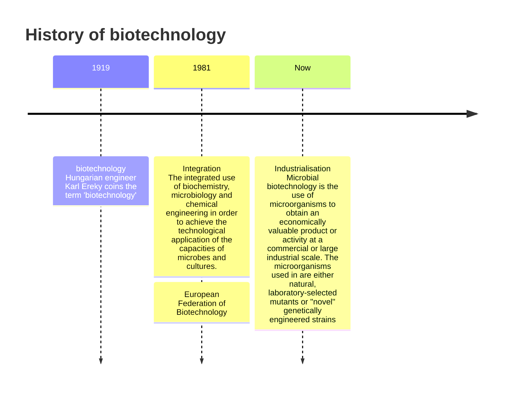

#### The Development Of Biotechnology

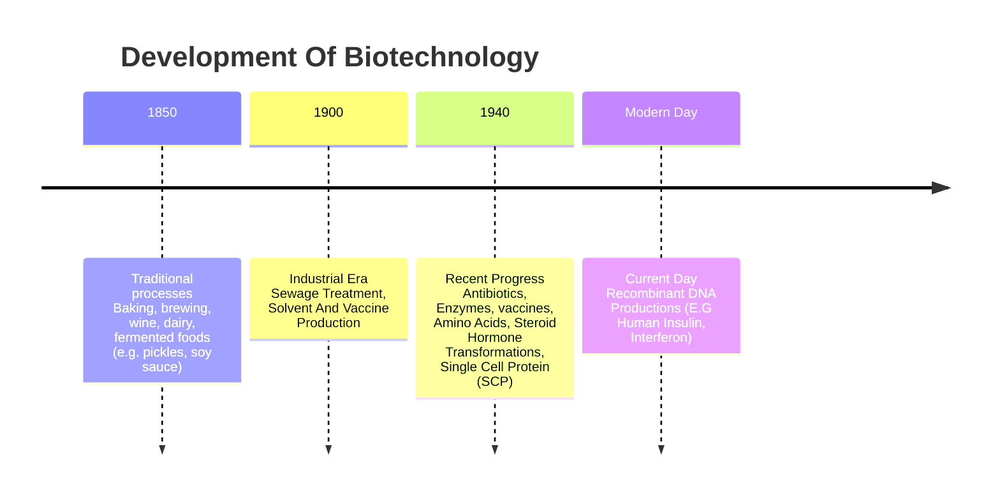


### Types Of Processes
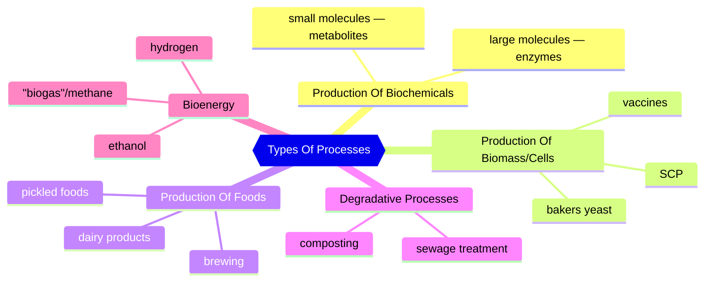

### Reasons Microorganisms Are Used In Biotechnology

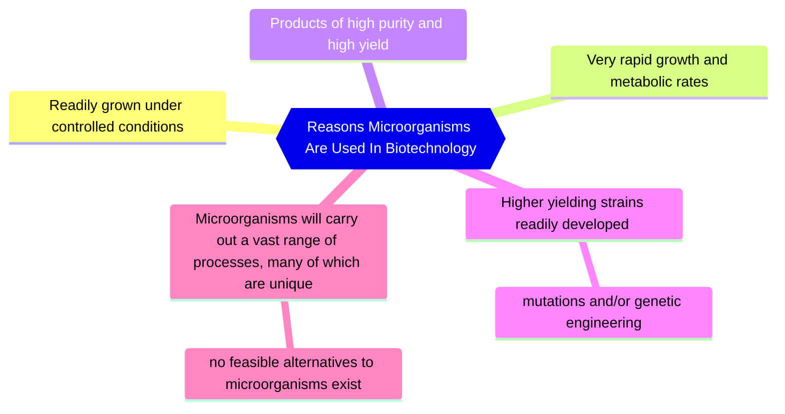


### Nutritional and cultural requirements for the growth of microorganisms


**Product:** commercially valuable resultant
Product Examples: amino acids to improve food taste, quality or preservation, enzymes, vitamins or pigments, hydrogen
**Essential Reactant:** the key factor to the process (The microbe)

### Basic principles of industrial processes


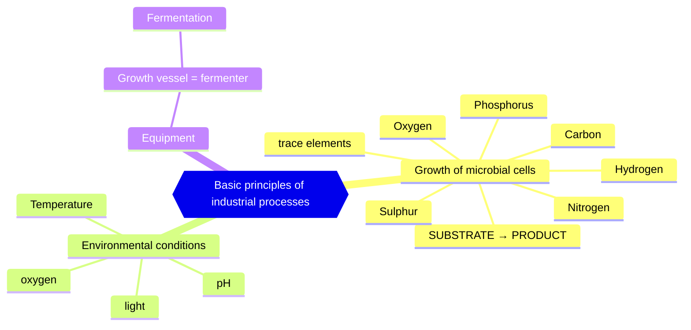


### Fermenter & associated process
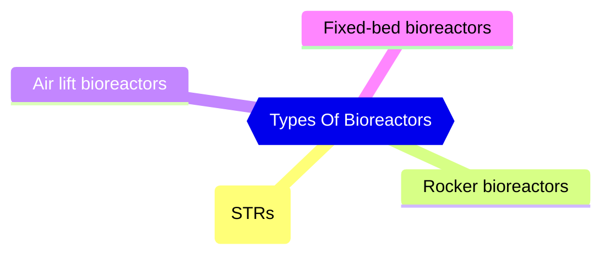


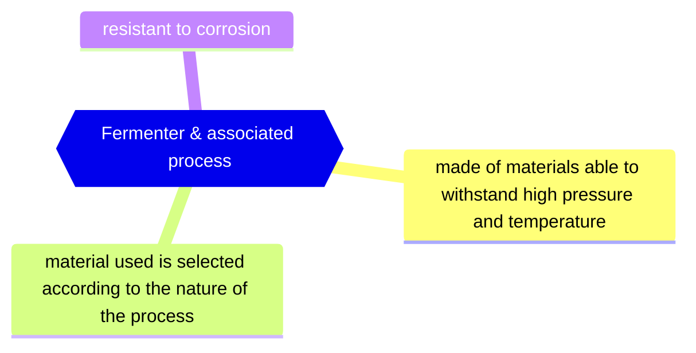


#### Sterilisation
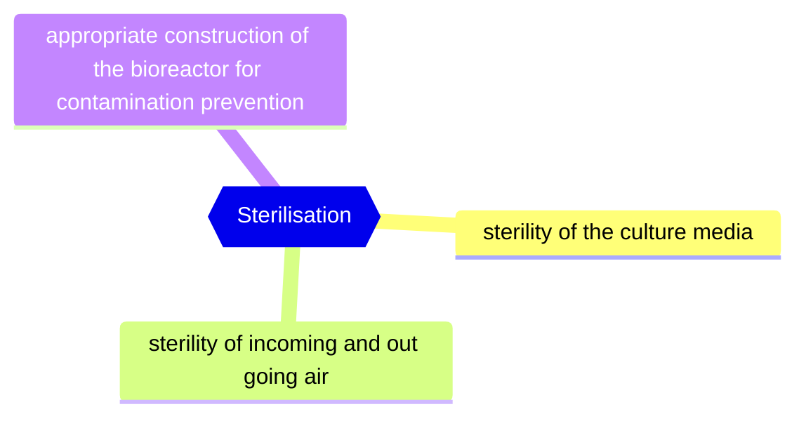


#### Common measurements and control systems in fermenters
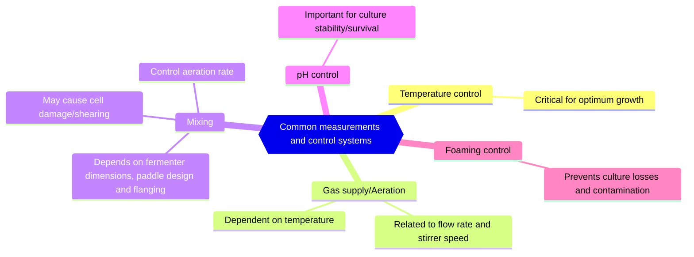
Important to keep factors constant during the process using a suitable control system (Like sensors/ biosensors)
[[Uni/3/6AB023 Microbial Biotechnology/Microbial Biotechnology#Temperature control\|#Temperature control]]
[[Uni/3/6AB023 Microbial Biotechnology/Microbial Biotechnology#pH control\|#pH control]]
#### Agitation
Agitation is performed in order to mix all three phases into a homogenous condition:
- **liquid** ( in the form of dissolved nutrients and metabolites)
- **solid** (in the form of cells and any solid substrates)
- **gas** (in the form of oxygen and carbon dioxide)

This promotes nutrient, gas and heat transfer.
Especially Important for oxygen transfer into liquid from the gas phase

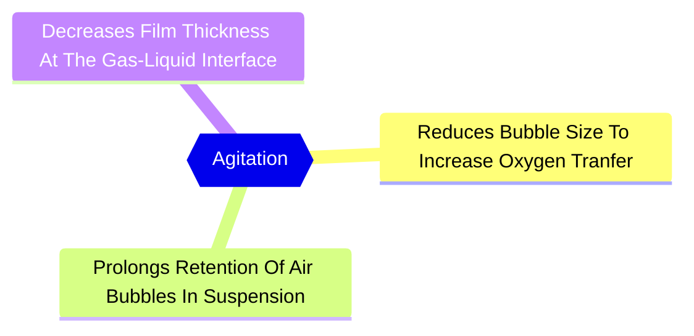


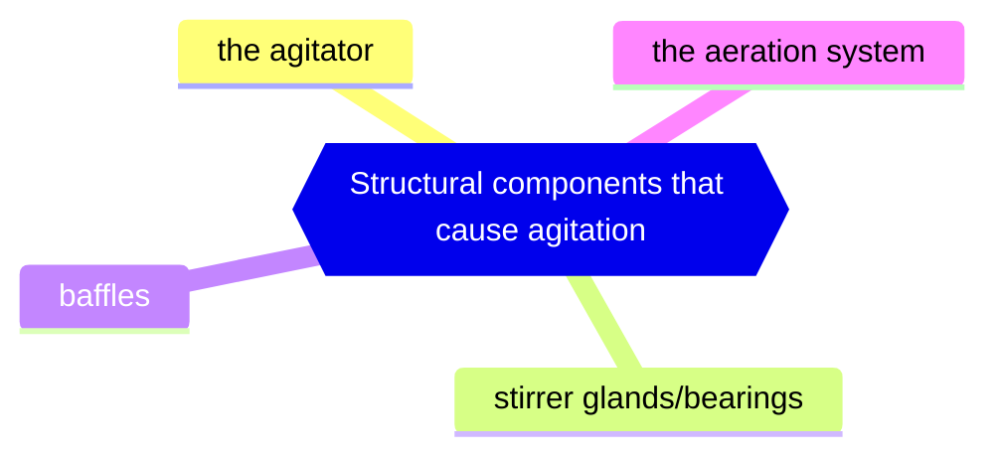


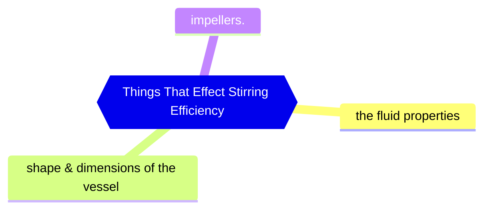

#### Basic functions of a fermenter
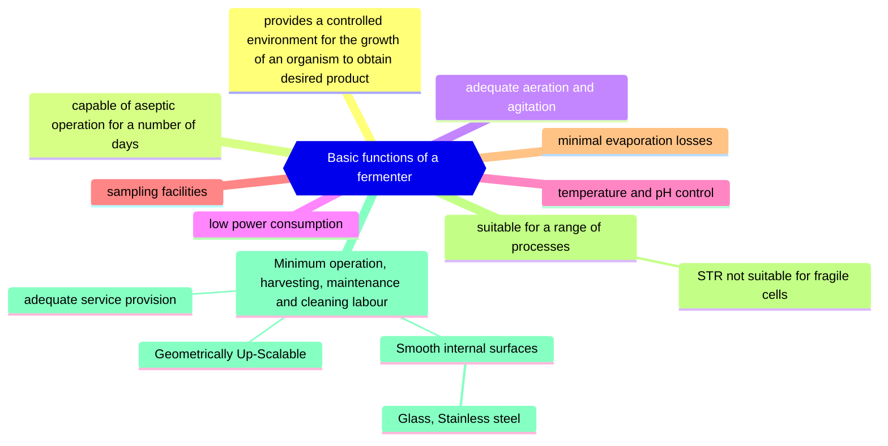


#### Chemical engineering process
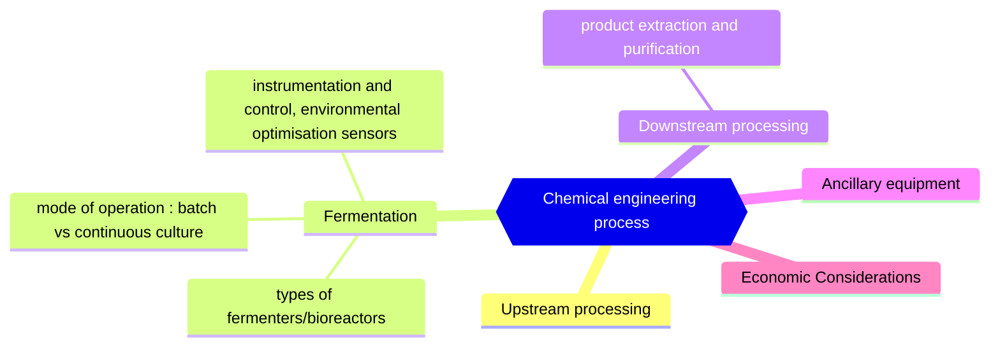


#### A schematic representation of typical fermentation process


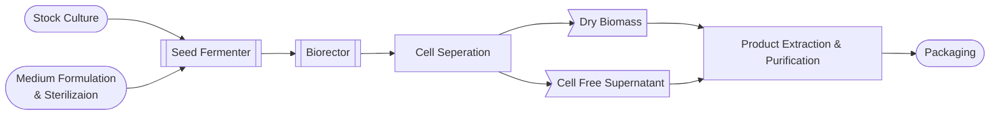


#### Associated equipment
- **Bacterial cells** are generally robust and readily grow; many possible systems
- **Plant/animal cells** are fragile, less adaptable, slow growth; modify systems to suit
- **Photosynthetic cells** uniquely require light

#### Fermentation Processes
##### Batch Fermentation
Batch fermentation is a "closed system", all nutrients necessary for cell growth and product production are present in the medium from start and is finished when (mostly carbon sourced) nutrients have been used by the biomass

Only a limited amount of the carbon source can be used which limits generation of the product.


##### Fed Batch Fermentation


DOT: dissolved oxygen tension

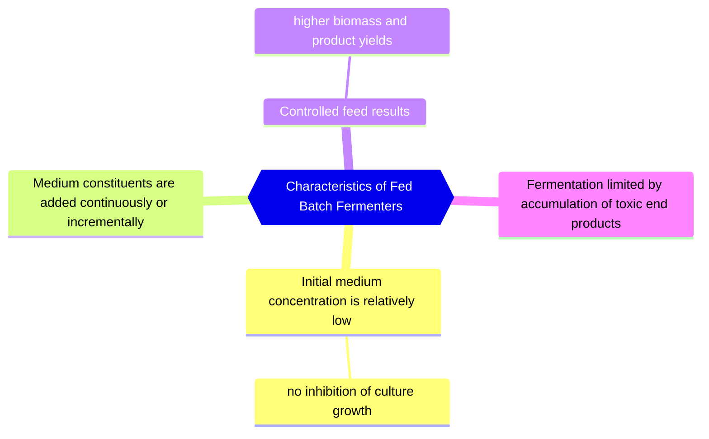


Medium Constituents: Concentrated Carbon And/Or Nitrogen


##### Continuous Fermentation
- Input rate = output rate (volume = const.)

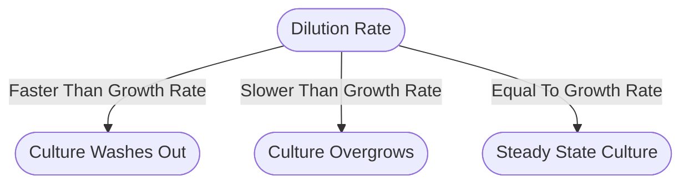


- Product is harvested from the outflow stream
- Stable chemostat cultures can operate continuously for weeks or months.

#### Fermenter design
the design of a fermenter to carry out a fermentation in an efficient and predetermined manner is the most important objective function of fermentation engineering

##### Stirred tank reactor (STR) or Stirred tank fermenter (STF)
STR has mechanically moving impellers within baffled cylindrical vessel Whereas The STF Has No Moving Internals


A schematic of a continuous flow stirred tank reactor

###### Production of mycophenolic acid by Penicillium brevicompactum immobilized in a rotating fibrous-bed bioreactor (RFB)
Fungal morphology observed in free-cell stirred-tank (STF) and immobilized-cell rotating fibrous-bed (RFB) fermentations:

STF (A):
- fungal mycelia grew everywhere
- large clumps of biomass was attached to the agitation shaft, pH and DO probes, reactor wall

RFB (B):
- all fungal mycelia were attached to the rotating fibrous matrix, forming a homogeneous biofilm,
- fermentation broth was clear.


##### Z®RP bioreactor
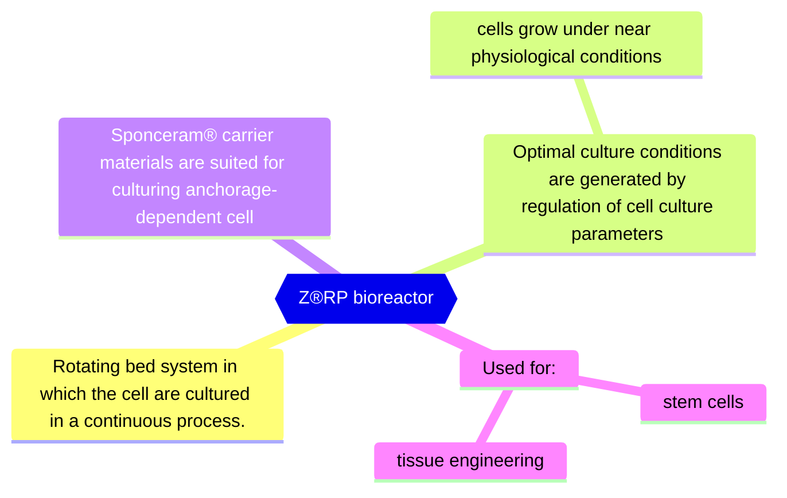


Small Fermenters Produce Less Waste

###### Z®RP Implant Blanks

A - SEM capture of chondrocytes in ECM, long-term culture on Sponceram® HA surface (5000-times magnification)- skin-like tissue
B- Cartilage layer, grown in vitro on Sponceram® HA cell carrier (courtesy of TU Hamburg-Harburg) - bone-like

Blanks Support Growth In The Shape You Need

##### Airlift fermenters
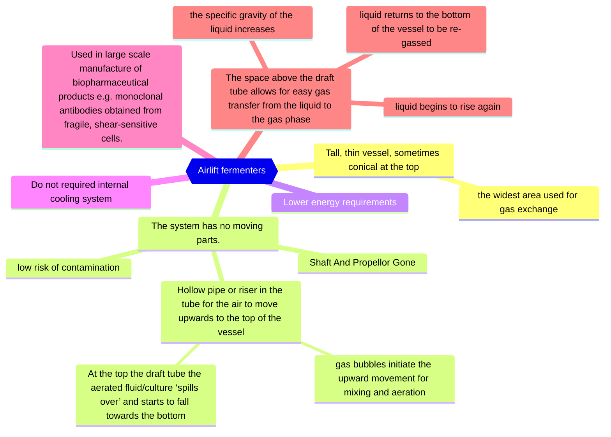


a) draft-tube configuration, b) a split cylinder device, c) an external loop system

##### Photobioreactors

###### Scale-up of Oldenlandia affinis cultures in air-lift photobioreactors
- Plants are source of a large number of useful pharmaceuticals.
- Cyclotides are di-sulfide rich mini-proteins with broad range of biological activity such as anti-HIV, cytotoxic and antimicrobial.
- The major problems hindering the development of large-scale cultivation of plant cells include:
	- low productivity, cell line instability
- Shake flask cultures are used, but industrial fermentation of natural products requires highly reproducible conditions.
- Need for scale-up and fermenter.

###### Photobioreactors for cyclotide production
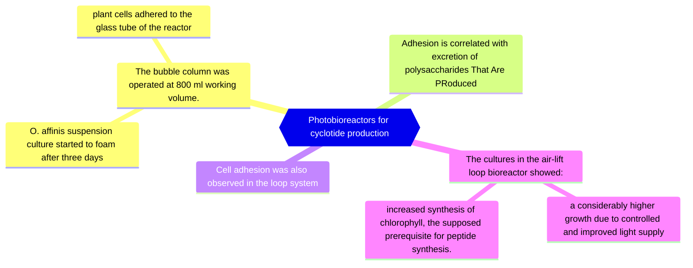

### Environmental monitoring and control
- The success of fermentation depends upon the existence of defined environmental conditions for biomass production and product formation.
- We need to know how to obtain optimal operating conditions.
- [[Uni/3/6AB023 Microbial Biotechnology/Microbial Biotechnology#Common measurements and control systems in fermenters\|#Common measurements and control systems in fermenters]]

#### SENSORS

```mermaid
mindmap
{{Types Of Sensors}}
	Physical sensors
		thermistor
		gas flow meter
		tachometer
		foam sensor
	Chemical sensors
		pH meter
		Disolved Oxygen electrode
		CO2 analyser
		oxygen analyser
		NAD analyser
		Biosensors — Type of chemical sensor.
```

##### Biosensor
Measuring device which employs biologically active material (that it is made of) which provides specific recognition of the target analyte, to a physical or chemical transducer, which generates electrical signal directed to a digital reader/control system.


```mermaid
mindmap
{{Bioactive components}}
	Enzymes
	Monoclonal antibodies
	Cells
		microorganisms
		tissues
	Nucleic acids
```


Advantages:
- high selectivity
- high specificity
- relative low cost
	- reduce assay time
	- can increase product safety
- small size
- on-line control of the fermentation process

Restrictions:
- optimal pH
- optimal temperature


#### Biosensor in monitoring and control


```mermaid
flowchart TB
    A(["Analyte"])
    B["Bioreceptor"]
    C["Bio-Recognition"]
    D["Transducer converts on type of energy to another"]
    E(["Signal processing, display, comparison to calibrations"])
    D --> E
    C --> D
    B --> C
    A --> B
    click B "[[#SENSORS]]"
    click D "[[#Transducer]]"
```


#### Immobilised enzyme biosensor

- Porous polycarbonate layer
	- limits the diffusion of the substrate into the second Immobilised Enzyme Layer
		- preventing the reaction becoming enzyme-limited
- The third layer, cellulose acetate, permits only small molecules, such as hydrogen peroxide, to reach the electrode
- The substrate is oxidised, in the enzyme layer, producing hydrogen peroxide, oxidised on platinum electrode
- The resulting current is proportional to the concentration of the substrate

#### Penicillin biosensor


### Transducer
A physical element which converts the stimulus generated by the bioactive layer to an electrical signal.

```mermaid
mindmap
{{Transducer}}
	Can Be:
		Electrochemical
			amperometric
			potentiometric
		Optical
		Mechanical
		Thermal
	May detect:
		a redox reaction
		light emission
		changed levels of ions
		luminescent/fluorescent signal
		a change in mass associated with surface
```
##### Linearity
###### In-line
- an integrated part of the fermentation equipment, obtained data are used directly for process control

###### On-line
- an integrated part of the fermentation equipment, direct measurement of fermentation parameters, the measured value cannot be used directly for control, an operator required for entering the data into the control system e.g. gas analyser
###### Off-line
- not part of the fermenter, requires sampling, the measured value cannot be used directly for control, operator needed for measurement and entering the data into the control panel
	- e.g. sample for spectrophotometric analysis

Real-time → instant, as it happens
### Computer Usage In Fermentation
```mermaid
mindmap
{{Computer Usage In Fermentation}}
	Process control
		timed series of operations
			sterilisation
			medium addition
			inoculation
	Data logging 
		printer
		data store
		graphics
	Alarms
	Environmental control 
		pH
		temperature
		Gas Availability
	Dynamic optimisation
		instant response to the sensed environment to maintain environmental and physiological conditions
	maximise culture productivity
	Modelling of fermentations
```

#### Temperature control
```mermaid
mindmap
{{Temperature control}}
	Heat supplied by direct heating probes or by heat exchange
	Microbial growth is very sensitive to temperature changes accurate temperature feed-back control is required
	Fermentations are exothermic - cooling may be required
```

#### pH control
```mermaid
mindmap
{{pH control}}
	Most cultures have narrow pH growth ranges
	The buffering in culture media is generally low
	Most cultures cause the pH of the medium to rise during fermentation
	pH is controlled by using a pH probe, linked via computer to NaOH and HCl input pumps.
```


### Foaming

 Foaming is caused when:
- microbial cultures excrete high levels of proteins and/or emulsifiers
- high aeration rates are used

Excess foaming causes loss of culture volume and may result in culture contamination

Foaming is controlled by use of a foam-breaker and/or the addition of anti-foaming agents (silicon-based reagents)

#### SPINNING CONES AS FOAM CONTROLLERS

## Week 2 Biodegradable Polymers.  

### Terminology

##### Polymer
are large molecules (macromolecules)  composed of many repeated sub-units (monomers)  

##### homopolymer
Only one subunit 
E.G -A-A-A-A-A-  

##### heteropolymer (co-polymer) 
Multiple subuinits 
E.G -A-B-B-A-C-  

##### Biopolymer 
polymer made from natural resources E.G Starch

##### Bioplastic
large family of different materials (either biobased, biodegradable or both)  
if biodegradable, it must be degraded completely, to only  natural biogenic compounds such as water, CO2, biomass  

##### Biobased
material derived from biomass - renewable resources, not from fossil oil  

##### Biodegradable
able to decay naturally and in a way that is not harmful
Biodegradability depends on the chemical structure of the material 

### Polymeric Materials
Classification by susceptibility to microorganism/enzymatic attack:  

#### Non-biodegradable  
(polyethylene – PE, polypropylene – PP,  polystyrene – PS)  

#### Biodegradable  
(polylactide – PLA, regenerated cellulose, starch, bacterial polymers)

### Polymers and plastics  
Plastics are materials formulated and prepared for use  
The main components of plastics are the polymers with additives  


### Biopolymers & Microbes

#### Which biopolymers should be produced ?
- Currently only a few biopolymers can compete with their petrochemical equivalents  
	- based on price & performance  
- Bacterial cellulose (BC), Poly-glutamic acid (PgGA) Poly-hydroxyalkanoates (PHA) and Poly-lactic acid (PLA) are good examples of biopolymers that could capture a substantial part of the bioplastic market  
#### What is poly-γ-glutamic  
- Polymer of glutamic acid residues.  
	- unusual anionic polypeptide in which D and/or L-glutamate is polymerized via γ-amide linkages  
- Non-toxic, non-immunogenic and edible  

Anthrax Capsule Made From Glutamic Acid
##### Applications of γ-PGA
```mermaid
mindmap
{{Applications of γ-PGA}}
	FOOD  
		Cryoprotectant  
		Bitterness relieving agent
		Thickener  
		Humectant  
		Properties of wheat dough  
	MEDICAL  
		Drug delivery  
		Nanoparticles  
		Biological adhesive  
		Biodegradable scaffold  
		Anti-mutagenic agent  
	OTHER  
		Waste water treatment  
		Cosmetics  
		Diapers 
```


### Analysis  

Salt/Acid form of γ-PGA (ICP)  
Yield (g/l)  
Crystallinity (XRD)  
Identification (FTIR, NMR)  
Molecular weight (GPC)

#### Yield


#### XRD


#### Molecular weight  

#### Medium E

#### Medium GS


#### Hemolytic activity
 

#### Lecithinase activity


#### PCR of genes encoding toxins


#### Probiotics  
Live microorganisms that when administered in adequate amounts confer a health benefit on the host

#### Maintaining viability of ‘friendly’ bacteria
Freeze drying 
Storage 
Ingestion  

#### Viability of B. breve in simulated gastric juice (Free cells and polymer protected cells)  


### Cancer therapies  

Use of oncolytic adenovirus coated with γ- PGA for effective and safe cancer therapy.
Smart Adenovirus Nano complexes as a Therapeutic Vehicle


#### Oncolytic Ad  
- preferentially infects and kills cancer cells 

##### Limitations
- Immune response  
- High liver tropism  
- Lack of tumour tropism upon systemic delivery  


##### Modification of Ad is needed to:  
- increase retention time in the blood  
	- More Likely To Encounter Cells
- avoid accumulation in the liver

###### Ionic-gelation Method  
Encapsulation efficiency 93%  

###### HEK 293 cells
(Proof That The Particle Can Get Into The Cell)
- Visible clear attachment and/or internalisation of NPs  
- PGA can boost cellular uptake possibly through a specific receptor-mediated pathwayFITC-labelled γ-PGA-chitosan NPs  


###### Sustainability
Needs To Be Cheap To Become Commercial/Viable
### Xerostomia, acidic drinks and bacterial  PGA  
- Salivary phosphoproteins protect the enamel from acid dissolution and acting as a reservoir for free calcium ions  
- A reduction in salivary flow leads to a prolonged dry mouth, known as xerostomia  
- Xerostomia include severe dental hard tissue destruction, leading to a clinical condition termed “rampant dental caries”  
The biochemical and physical properties of ɣ-PGA suggest its suitability as an anti-cariogenic agent, and a therapeutic treatment for rampant caries associated with xerostomia

#### Protection of tooth enamel project  
Microbial polymer of γ-PGA tested showed an excellent inhibitory effect on the dissolution rate of  
calcium ions form teeth enamel  
Is The Calcium In The Acid Solution (From The Teeth)

#### Brown Algae as a Valuable Substrate for the Cost- Effective γPGA for Applications in Cream Formulations  
- Successful incorporation of seaweed-derived γ-PGA (0.2–2 w/v%) was achieved for several model cream systems with absorbances reported at 300 and 400 nm.  
-  Seaweed-derived γ-PGA cream systems did not display any negative effect on model HaCaT keratinocytes by means of in vitro MTT  

#### Can γ-PGA help fight Parkinson’s ?  
- γ-PGA has previously demonstrated anti inflammatory/antioxidative properties and has shown to alleviate neuronal cell death  
- Can γ-PGA reverse cytotoxic effect and cellular inflammation?  
- Can γ-PGA be explored as a potential therapeutic molecule in the context of α-synuclein pathology?

#### Can microbes help fight Parkinson’s ?  
- Parkinson’s disease (PD) affects around ten million people worldwide  
- PD is the second most widespread neurodegenerative disease after  
- PD pathology is characterized by a loss of dopaminergic neurons and the development of lewy bodies - proteins, mainly α-synuclein.
- α-synuclein during stress or degeneration can be released into extracellular environment and can be taken up by neurons and astrocytes  
- astrocytes normally are involved in clearance of α-synuclein, therefore protect neurones, however their capacity is limited  
- extensive uptake leads to cellular toxicity and inflammation and astrocytes loose protective role

#### γ-PGA as a chelator of protein accumulation  
Alzheimer's disease, Parkinson's diseases, amyotrophic lateral sclerosis, dementia with Lewy bodies, frontotemporal dementia, Huntington's disease, amyloid transthyretin cardiomyopathy are all Protein aggregation diseases  

#### γ-PGA limits the extent of α-synuclein PFFs in primary astrocytes  
γ-PGA has a marked inhibitory effect on astrocyte ability to internalize α- synuclein PFFs, leading to reduced cellular toxicity  

#### Problems with synthetic plastics  
- Plastics litter oceans and the coastlines  
- Plastics use valuable/limited oil resources  
- Some plastics leach small amounts of pollutants, that are toxic to life  
- PE the most manufactured pertochemical polymer (29% of global production)  
- Only 10% recycled !  

#### Microbial bioplastic  
- Are produced bacteria as a carbon and energy storage material  
- Synthesized as intracellular granules  
- Accumulated as a result of nutrient limitation in the presence of excess supply of carbon source 

#### Microbial polyhydroxyalkanoates (PHA)
- Are produced by bacteria as a carbon and energy storage material  
- Synthesized as intracellular granules  
- Accumulated as a result of nutrient limitation in the presence of excess supply of carbon source 

#### Polyhydroxyalkanoates (PHAs)  
- Are produced bacteria as a carbon and energy storage material  
- Synthesized as intracellular granules  
- Accumulated as a result of nutrient limitation in the presence of excess supply of carbon source 


#### Bacterial PHB  
- Homopolimer -A-A-A-A-A-  
- White crystalline powder with isotactic structure  
- High molecular weight and melting point (~180 oC)  
- Biodegradable and non-toxic  
- BUT rather brittle  


Copolymers -A-A-A-B-B-A-C-  
- different monomers, almost always 3-hydroxy fatty acids  
- BUT may also contain 4-, 5- and 6- hydroxy fatty acids or monomers with aromatic rings  

- Mixed carbon sources needed

##### Biomaterial properties

| Parameter                  | PHB | PHBV | PHBHx | PP    |
| -------------------------- | --- | ---- | ----- | ----- |
| Melting temperature (°C)   | 177 | 145  | 127   | 176   |
| Glass transition temp (°C) | 2   | -1   | -1    | -10   |
| Crystallinity (%)          | 60  | 56   | 34    | 50-70 |
| Tensile strength (MPa)     | 43  | 20   | 21    | 38    |
| Extension to break (%)     | 5   | 50   | 400   | 400   |

##### Where are applied 
```mermaid
mindmap
{{Common Biomaterial Uses}}
	AGRICULTURE  
		mulch films  
	MEDICAL
		biodegradable scaffolds  
		controlled antibiotic release systems 
		implants
		sutures  
		heart valves  
		bone graft substitutes  
	OTHER  
		Packaging  
		Coatings  
		Car industry  
		Textiles
```


#### Bacterial bioplastics from waste cooking oil  
Waste cooking oil → Bacteria with PHA → granules Bioplastics!  
‘Work by a research team at the University of Wolverhampton suggests that using  
waste cooking oil as a starting material for the production of bioplastic can  
reduce production costs significantly…’  

#### Electrospun Fibres of Polyhydroxybutyrate Synthesized by Ralstonia eutropha from Different Carbon Sources  


#### PHA as biomaterials  
- biomedical/pharmaceutical areas have been approved by FDA in 2007  
- PHAs are biodegradable, biocompatible, they are used to produce microspheres, microcapsules, and nanoparticles, films and porous matrices  
- their degradation products are non toxic  
- drug release from the polymeric material occurs through osmosis, diffusion or biodegradation mechanism  
	- release depends on composition of the composition of PHA

#### 3D printed PLA/PHA filaments  
Vertical specimens have improved mechanical properties compared to horizontal specimens,  
MTT assay with HEK293 shows the horizontally printed specimen tended to produce more growth from day 4 onwards.  

#### PHA applications  
- Regenerative medicine  
- Bio-implants  
- 3D printing material  
- Surgical stitching and coronary stents  
- Time release capsules  


#### Bacterial Cellulose 
- Bacterial cellulose (BC) is a natural biopolymer synthesized in abundance by different strains of bacteria  
- Consist only glucose monomer  
- BC unique properties:  
- Biocompatibility  
- Can be mouldable into 3D structures  
- Chemically pure  
- Ultra fine network
- Bacterial cellulose (BC) is a natural biopolymer synthesized in abundance by different strains of bacteria  
- Acetobacter sp, Rhizobium sp.  
- Consist only glucose monomer  
- BC unique properties:  
- Biocompatibility  
- Mouldable into 3D structures  
- Chemically pure  
- Ultra fine network


##### Why it is produced  

Virulence

##### Where has it been applied?  


Phylogenetic tree of bacteria and archaea, highlighting those that carry out fermentation
